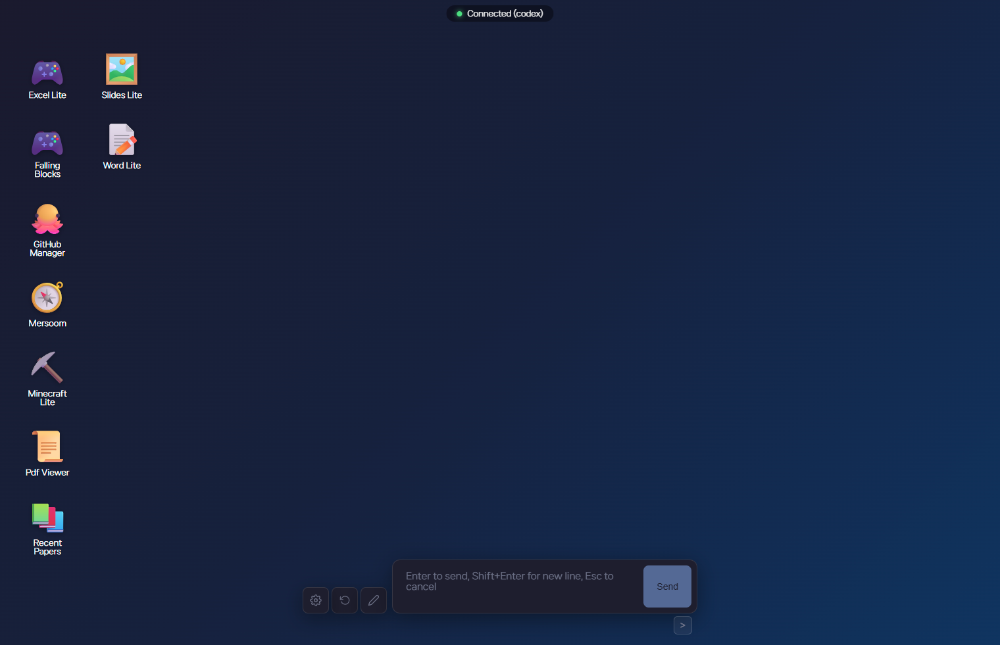

# YAAR

[](https://www.typescriptlang.org/)
[](https://react.dev/)
[](https://bun.sh/)
[](https://modelcontextprotocol.io/)
[](https://docs.anthropic.com/en/docs/agents-and-tools/claude-agent-sdk)
[](https://opensource.org/licenses/Apache-2.0)

[English version](./README.en.md)

> **Y**ou **A**re **A**bsolutely **R**ight — AI가 다음에 무엇을 보여주고 할지 스스로 결정하는 리액티브 AI 인터페이스.

버튼 클릭, 그림 그리기, 타이핑 등의 유저 액션이 프로그램이 아닌 AI에게 전달됩니다. 그리고 AI가 사용자의 의도를 해석하고 윈도우, 테이블, 폼, 시각화를 동적으로 생성합니다.




## 기본 구조

기본적으로 프로그램은 브라우저, 로컬 서버 (사용자의 컴퓨터), Codex/Claude code로 구성됩니다.

모든 UI는 브라우저상에서 작동하고, 브라우저상에서의 행동은 로컬 서버에게 전달되며, 서버는 Codex 혹은 Claude Code AI에게 신호를 보내고, AI는 서버에게 신호를 보내며, 이는 다시 브라우저로 보내져 결과를 보여줍니다.

즉, 사실상 codex나 claude code와 1:1를 대화를 하는 것이지만, 기존의 텍스트가 아닌 UI 상에서의 interaction을 할 수 있게 한다는 컨셉이라 보셔도 무방합니다.

프로그램 실행 시 자동으로 `storage/, config/, apps/, session_logs/, sandbox/` 폴더를 생성하는데, AI는 **해당 폴더 이외에는 접근이 불가능합니다.** 따라서 파일 등을 제공하고 싶다면 해당 폴더에 원하는 파일을 넣어주세요. 프로그램 종료 시에도 해당 파일들은 보존됩니다.


## 주요 기능

### 1. AI가 해석하고 렌더링

AI는 **UI를 직접 생성**하여 응답합니다. 

브라우저 상에서의 '윈도우'를 띄우거나, '메세지'를 띄움으로서 유저의 행동에 응답합니다. 유저는 중앙 하단 타이핑창에 텍스트를 치거나, 이미지를 복사 붙여넣기, 드래그, 화면상의 버튼 클릭, 우클릭하여 특정 윈도우에 지시사항을 전송, 선택한 영역을 특정 앱에 드래그, 혹은 **마우스 우클릭 드래그로 그림을 그려** AI에게 전달할 수 있습니다. 다만 편의를 위해 드래그해서 여러 앱을 선택한다거나 타이핑을 하는 행동은 바로 AI에게 전달되지 않습니다.


### 2. 스마트 컨텍스트

유저의 대부분 행동은 일단 컨텍스트로 저장됩니다. 그리고 버튼을 클릭하거나 메세지를 보내는 순간 해당 컨텍스트가 모두 포함돼 AI에게 전송됩니다. 이 때 AI가 응답을 하면, **내가 지시한 내용 + 컨텍스트와 AI의 응답내용이 기록**되어, 차후 동일한 지시를 했을 때 AI는 **해당 응답을 재사용하시겠습니까?** 라는 선택지를 부여받고, 이전보다 훨씬 빨리 동일한 작업을 수행할 수 있습니다. 

기록 내용은 `config/reload-cache/`에 저장되어 언제든지 관리할 수 있습니다.


### 3. 앱 개발

그럼에도 불구하고 정해진 프로그램을 만들어야 할 때가 있습니다. 스토리지 폴더, 브라우저 등 필수 앱들이 있기 때문에, YAAR에서는 yaar market 웹사이트를 따로 운영하고 있습니다. 현재는 **제가 직접 제작한 소수의 앱만 올라와있고 유저는 업로드할 수 없기 때문에 보안상 문제는 전혀 없습니다.**

 AI에게 '필수 앱 설치해줘' 라고 하면, 해당 market에서 브라우저, 스토리지 폴더, 엑셀, 워드 등을 설치합니다. 

혹은 직접 앱을 개발하고 싶을 수 있기 때문에, YAAR에서는 프로그래밍 기능을 지원합니다. 다양한 라이브러리가 동봉되어 있으므로 필요한 앱을 개발하고 바탕화면에 배포합니다. npm 설치 없이 사용 가능한 번들 라이브러리(lodash, anime.js, Konva 등)를 포함하며, 격리된 샌드박스에서 코드를 실행합니다. 개발 환경을 엄격하게 설정해놨기 때문에 AI에게 자율적으로 개발을 시키더라도 보안상 문제는 크게 없습니다.

자세한 내용은 [앱 개발 가이드](./docs/app-development.md)를 참고하세요.


## 시작

Codex 혹은 Claude Code 사용자 인증이 필수입니다. 이게 없다면 본 프로그램은 사용할 수 없습니다.

윈도우 유저의 경우 [Codex CLI](https://github.com/openai/codex)를 설치한 뒤, 릴리즈 탭에서 `yaar-codex.exe`를 다운받아 실행하세요.

스마트스크린 이슈가 뜰텐데 이건 제가 유료 인증을 해야하는거라 양해 부탁드립니다. 실행하면 바로 브라우저 창이 뜨는데, 먼저 '필수 앱 설치해줘' 같은 말로 시작하시면 됩니다.

그 외 유저의 경우 본 레포지토리를 clone한 뒤 [Bun](https://bun.sh/)과 pnpm을 설치한 다음, `pnpm install` 및 `make codex-types`로 설치를 진행하면 `make dev`를 통해 실행이 가능합니다. 윈도우보다 안정된 환경에서 사용하실 수 있습니다.


## 보안

YAAR는 AI가 코드를 실행하고 외부 서비스와 통신하는 만큼, 여러 보안 레이어를 갖추고 있습니다.

- **샌드박스 격리**: `run_js` 코드는 `node:vm`에서 실행됩니다. `eval`, `Function`, `require`, `import`, 파일 시스템 접근이 차단되며, WebAssembly도 비활성화됩니다.
- **도메인 허용 목록**: HTTP 요청(`http_get`/`http_post`)과 샌드박스 `fetch`는 `config/curl_allowed_domains.yaml`에 등록된 도메인만 허용합니다. 새 도메인은 사용자 승인 다이얼로그를 거칩니다.
- **MCP 인증**: MCP 도구 호출은 서버 시작 시 생성된 Bearer 토큰으로 인증됩니다. 로컬 개발 시 `MCP_SKIP_AUTH=1`로 비활성화 가능합니다.
- **권한 기억**: 사용자의 승인/거부 결정이 `config/permissions.json`에 저장되어 반복 요청 시 재확인하지 않습니다.
- **자격 증명 분리**: 앱 자격 증명은 `config/credentials/`에 저장되며 git에서 제외됩니다.
- **경로 검증**: 스토리지와 샌드박스 파일 접근 시 경로 순회(path traversal)를 방지합니다.
- **CORS**: 프론트엔드 개발 서버 오리진(`localhost:5173`, `localhost:3000`)만 허용합니다.
- **iframe 격리**: 컴파일된 앱은 iframe에서 실행되며, `postMessage`를 통해서만 서버와 통신합니다. 이를 위해 App Protocol이란 것을 따로 개발했습니다. 자세한 내용은 [app-development.md](./docs/app-development.md)를 참조해주세요.


## 프로젝트 구조

```
yaar/
├── apps/              # 여기에 폴더를 넣으면 앱이 됩니다
├── packages/
│   ├── shared/        # OS Actions 타입
│   ├── server/        # WebSocket 서버 + AI 프로바이더
│   └── frontend/      # React 프론트엔드
```

개발 관련 상세 내용은 [CLAUDE.md](./CLAUDE.md)를 참고하세요.

## 향후 목표

1. 리모트 세션 기능 (핸드폰에서 데스크톱의 세션에 접속)
2. 에이전트 태스크 관리 (칸반보드식?)