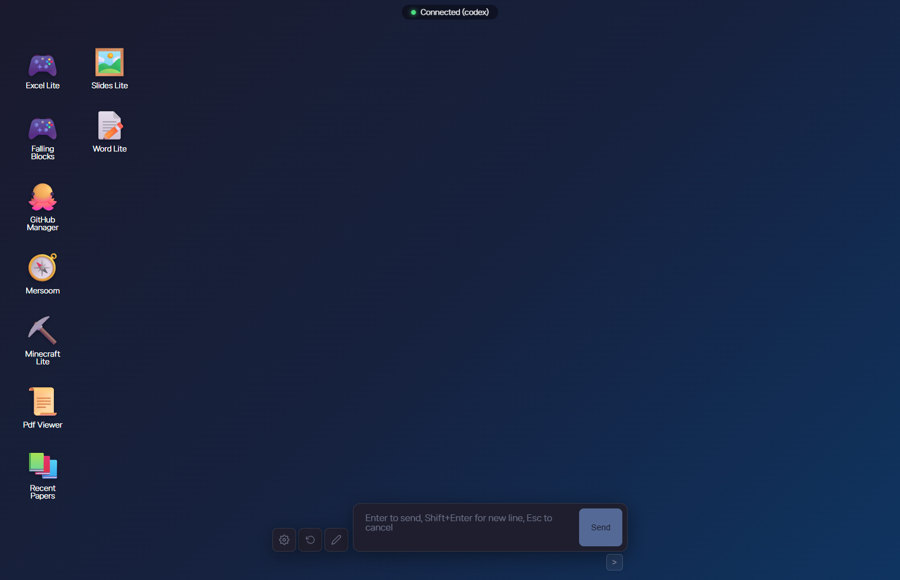

# YAAR

[](https://www.typescriptlang.org/)
[](https://react.dev/)
[](https://bun.sh/)
[](https://modelcontextprotocol.io/)
[](https://docs.anthropic.com/en/docs/agents-and-tools/claude-agent-sdk)
[](https://opensource.org/licenses/Apache-2.0)

[English version](./README.en.md)

> **Y**ou **A**re **A**bsolutely **R**ight — AI가 다음에 무엇을 보여주고 할지 스스로 결정하는 리액티브 AI 인터페이스.

버튼 클릭, 그림 그리기, 타이핑 등의 유저 액션이 프로그램이 아닌 AI에게 전달됩니다. AI가 사용자의 의도를 해석하고 윈도우, 테이블, 폼, 시각화를 동적으로 생성합니다.




## 빠른 시작

Codex 혹은 Claude Code 사용자 인증이 필수입니다.

**윈도우 유저:** [Codex CLI](https://github.com/openai/codex) 설치 후, 릴리즈 탭에서 `yaar.exe`를 다운받아 실행하세요. 스마트스크린 경고가 뜰 수 있습니다 (코드 서명 미적용).

**그 외 유저:**
```bash
git clone https://github.com/sorryhyun/yaar.git && cd yaar
bun install && make codex-types
make dev          # 브라우저가 자동으로 열립니다
```

실행 후 "필수 앱 설치해줘" 같은 말로 시작하시면 됩니다.


## 이런 걸 할 수 있습니다

- **"이 CSV 분석해줘"** → AI가 데이터를 읽고 차트 윈도우를 열어 시각화
- **"깃허브 이슈 확인해줘"** → GitHub Manager 앱에서 이슈 목록 표시 및 관리
- **"발표 자료 만들어줘"** → Slides Lite로 슬라이드 덱 생성
- **우클릭 드래그로 그림 그리기** → AI가 스케치를 해석해서 코드나 다이어그램으로 변환
- **"테트리스 만들어줘"** → AI가 코드를 작성하고 빌드해서 바로 플레이 가능한 앱 배포


## 기본 구조

```
브라우저 (UI) ←→ 로컬 서버 ←→ Claude Code / Codex (AI)
```

사실상 Claude Code나 Codex와 1:1 대화를 하는 것이지만, 텍스트가 아닌 UI 상에서 인터랙션을 할 수 있게 한다는 컨셉입니다.

실행 시 자동으로 `storage/, config/, apps/, session_logs/, sandbox/` 폴더를 생성하며, AI는 **이 폴더 이외에는 접근이 불가능합니다.** 파일을 제공하고 싶다면 해당 폴더에 넣어주세요.


## 주요 기능

### AI가 해석하고 렌더링

AI는 **UI를 직접 생성**하여 응답합니다. 윈도우를 띄우거나, 알림 메세지를 표시하는 방식으로 유저의 행동에 반응합니다.

| 입력 방식 | 동작 |
|-----------|------|
| 타이핑 | 메시지 전송 |
| 이미지 붙여넣기 / 드래그 앤 드롭 | AI에게 이미지 전달 |
| 우클릭 드래그 | 그림을 그려서 AI에게 전달 |
| 버튼 클릭 | 윈도우 내 액션 실행 |
| 우클릭 → 윈도우 선택 | 특정 윈도우에 지시사항 전송 |
| 파일/영역을 앱으로 드래그 | 앱 간 데이터 전달 |

유저의 행동은 컨텍스트로 축적되었다가 메세지 전송 시 한꺼번에 AI에게 전달됩니다. AI 응답은 자동으로 캐싱되어, 동일한 지시 시 이전 응답을 즉시 재사용할 수 있습니다.


### 앱 생태계

YAAR Market에서 바로 설치할 수 있는 번들 앱:

| 앱 | 설명 |
|----|------|
| 📁 Storage | 파일 매니저 |
| 🌐 Browser | 스크린샷 스트리밍 기반 라이브 브라우저 |
| 📊 Excel Lite | 스프레드시트 (수식 지원) |
| 📝 Word Lite | DOCX/Markdown 문서 편집기 |
| 🎞️ Slides Lite | 프레젠테이션 편집기 |
| 📄 PDF Viewer | PDF 뷰어 |
| 🐙 GitHub Manager | GitHub 이슈/PR 관리 |
| 📰 RSS Reader | 멀티 피드 RSS 리더 |
| 🖼️ Image Viewer | 이미지 뷰어 |
| 🎬 Video Editor / Viewer | 영상 편집 및 재생 |
| 📄 Recent Papers | 학술 논문 브라우저 |
| 🕐 Dock | 시계, 날씨, 알림 패널 |

직접 앱을 개발할 수도 있습니다. 번들 라이브러리(lodash, anime.js, Konva, Solid.js 등)를 npm 설치 없이 사용 가능하며, 격리된 샌드박스에서 코드가 실행됩니다. 빌드된 앱은 **하나의 HTML 파일로 번들링**되어 어디서든 독립 실행 가능합니다. 자세한 내용은 [앱 개발 가이드](./docs/app-development.md)를 참고하세요.


### 멀티 모니터 & 세션

여러 **가상 데스크톱(모니터)** 을 만들어 작업을 분리할 수 있습니다. 각 모니터는 독립된 메인 에이전트와 대화 히스토리를 가집니다. 세션은 브라우저를 닫아도 유지되며, `?sessionId=X`로 다른 탭/기기에서 같은 세션에 접속할 수 있습니다.


### 원격 접속

`make claude` 또는 `make codex`로 실행하면 원격 모드가 자동 활성화됩니다. 터미널에 QR 코드가 표시되며, 핸드폰으로 스캔하면 토큰 인증까지 자동으로 처리되어 바로 접속됩니다. SSH 터널링을 통해 외부 네트워크에서도 사용 가능합니다. 자세한 내용은 [원격 접속 가이드](./docs/remote_mode.md)를 참고하세요.


### Hooks

`config/hooks.json`으로 이벤트 기반 자동화를 설정할 수 있습니다. 특정 이벤트 발생 시 자동으로 액션을 실행합니다. 자세한 내용은 [Hooks 가이드](./docs/hooks.md)를 참고하세요.


## 보안

AI가 코드를 실행하고 외부 서비스와 통신하는 만큼, 여러 보안 레이어를 갖추고 있습니다.

- **샌드박스 격리** — `node:vm`에서 실행, `eval`/`import`/파일시스템/WebAssembly 차단
- **도메인 허용 목록** — `config/curl_allowed_domains.yaml`에 등록된 도메인만 허용, 신규 도메인은 사용자 승인 필요
- **MCP 인증** — Bearer 토큰 기반 도구 호출 인증
- **권한 기억** — 승인/거부 결정을 `config/permissions.json`에 저장
- **iframe 격리** — 앱은 iframe 내에서 `postMessage`로만 서버와 통신
- **경로 검증** — path traversal 방지


## 프로젝트 구조

```
yaar/
├── apps/              # 여기에 폴더를 넣으면 앱이 됩니다
├── config/            # 사용자 설정 및 자격 증명 (git-ignored)
├── storage/           # AI가 접근하는 파일 저장소 (git-ignored)
├── packages/
│   ├── shared/        # OS Actions, WebSocket 이벤트, Component DSL 타입
│   ├── server/        # WebSocket 서버 + AI 프로바이더 (Claude/Codex)
│   └── frontend/      # React 프론트엔드
```

YAAR의 구조는 전통적인 OS 아키텍처로도 해석될 수 있습니다. `LiveSession`은 커널, 에이전트는 프로세스, MCP 도구는 시스템 콜, `storage/`는 파일시스템에 대응됩니다. 자세한 매핑은 [OS Architecture Map](./docs/os_architecture.md)을 참고하세요.

개발 관련 상세 내용은 [CLAUDE.md](./CLAUDE.md)를 참고하세요.
