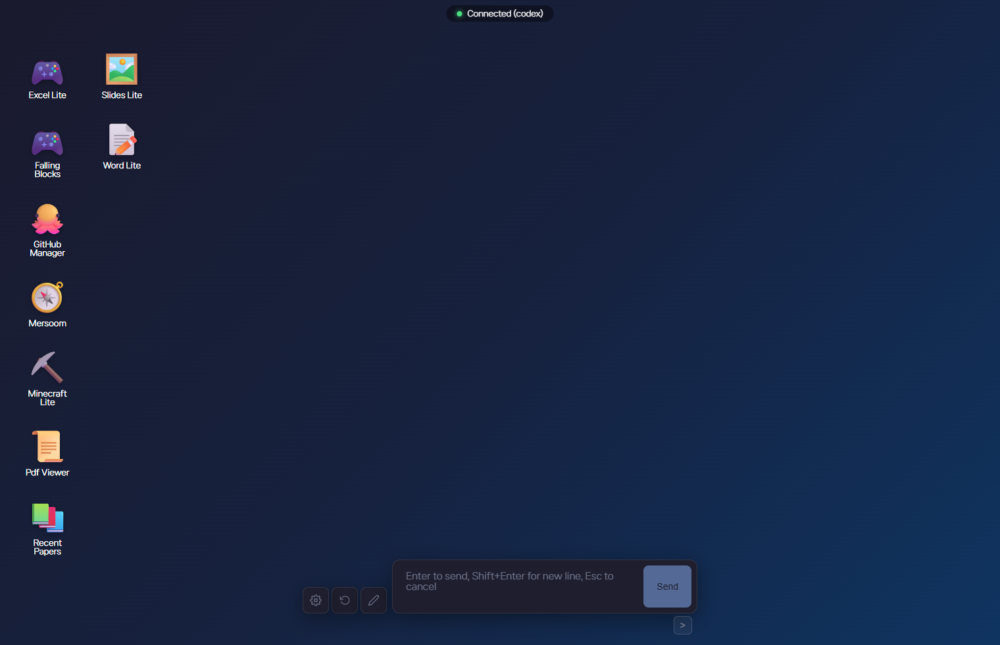

# YAAR

[](https://www.typescriptlang.org/)
[](https://react.dev/)
[](https://bun.sh/)
[](https://modelcontextprotocol.io/)
[](https://docs.anthropic.com/en/docs/agents-and-tools/claude-agent-sdk)
[](https://opensource.org/licenses/Apache-2.0)

[한국어](./README.ko.md)

> **Y**ou **A**re **A**bsolutely **R**ight — a reactive AI interface where the AI decides what to show and do next.



MCP tools, skills, plugins, and A2A — all within an 8K-token system prompt. Build apps, visualize data, and connect to external services.


## Install

Codex or Claude Code authentication is required.

```bash
curl -fsSL https://github.com/sorryhyun/yaar/releases/latest/download/install.sh | bash
yaar                # Browser opens automatically
```

Supports Linux, macOS (Intel & Apple Silicon), and Windows (WSL). Single binary — no Bun or Node.js required.

Windows (PowerShell): `irm https://github.com/sorryhyun/yaar/releases/latest/download/install.ps1 | iex`

Once running, start with something like "install essential apps".

<details>
<summary>Other install options</summary>

**Pin a version / custom install path:**
```bash
VERSION=v0.12.1 curl -fsSL ... | bash             # Specific version (default: latest)
INSTALL_DIR=/usr/local/bin curl -fsSL ... | bash  # Install path (default: ~/.local/bin)
```

**Windows:** You can also download `yaar.exe` directly from the [Releases page](https://github.com/sorryhyun/yaar/releases).

Bundled apps ship separately as `yaar-apps.tar.gz`; the install scripts extract them next to the binary automatically.

**Build from source** (requires [Bun](https://bun.sh/) >= 1.3):
```bash
git clone https://github.com/sorryhyun/yaar.git && cd yaar
bun install
make dev          # Browser opens automatically
```

</details>


## What You Can Do

- **"Analyze this CSV"** → AI reads the data and opens a chart window with visualizations
- **"Make a presentation"** → Slides Lite generates a slide deck
- **Right-click drag to sketch** → AI interprets your drawing and converts it to code or diagrams
- **"Build me a Tetris game"** → AI writes the code, builds it, and deploys a playable app

The whole desktop is an input surface, not just the text box:

| Input | Action |
|-------|--------|
| Typing | Send a message |
| Paste image / drag & drop | Send image to AI |
| Right-click drag | Draw and send sketch to AI |
| Button click | Execute in-window action |
| Right-click → select window | Send instructions to a specific window |
| Drag file/selection to app | Transfer data between apps |


## What's Different?

- **Everything runs on just 5 tools.** Every resource — windows, files, apps, config — is a `yaar://` URI, and five generic verbs operate on all of them. Agents discover capabilities at runtime via `describe`, so the system prompt stays flat whether you have 3 apps installed or 100 (see the [FAQ](./docs/faq.md#how-does-the-agent-actually-access-things-does-it-have-50-tools) for the concrete token budget).

  ```
  describe · read · list · invoke · delete

  invoke('yaar://windows/chart', { ... })    read('yaar://storage/data.csv')
  list('yaar://apps')                        delete('yaar://windows/old-panel')
  ```

- **One folder = one app.** Skills, plugins, agents, and UI are unified into a single convention: metadata (`app.json`, whose `description` doubles as AI-readable docs), an optional dedicated agent prompt (`agent/prompt.md`), and source that builds to one self-contained HTML file. Drop the folder in to install, delete it to uninstall — zero registration code.

- **Every app can have its own agent.** Drop in an `agent/prompt.md` and that app gets a dedicated agent that exchanges messages with the monitor agent. Apps can even drive other apps directly (`controls` in `app.json`) — Dev Tools, for example, pilots the real browser app to build and test an app end to end.

- **Permissions are explicit and scoped.** An app is confined to the `permissions` declared in its `app.json` plus its own storage. Outbound HTTP is limited to a domain allowlist, new domains require your approval, and every allow/deny decision is recorded. Details in [Security](#security).

- **The AI responds with UI, not text.** Instead of markdown replies, it opens windows, shows notifications, and manipulates apps — and its responses are cached, so re-rendering a window doesn't re-query the AI.

- **The UI stays live with its data.** Apps subscribe to `yaar://` URIs and the server pushes updates when those resources change — no polling, no asking the AI again to refresh a view.

Curious about the reasoning — why a GUI instead of a TUI, why it's shaped like an OS, why the web? See the [FAQ](./docs/faq.md).


## How It Works

```
Browser (UI) ←→ Local Server ←→ Claude Code / Codex (AI)
```

On startup, the program creates `storage/, config/, apps/, session_logs/` folders, and the AI's file access is scoped to these by default. To give the AI access to an external directory, use the "Mount..." button in the Storage app — specify an alias and path, and it becomes available at `storage/mounts/{alias}/` with optional read-only protection.


## Key Features

### App Ecosystem

Browse and install apps from YAAR Market — a file manager, spreadsheet, document and slide editors, PDF/image/video viewers, an RSS reader, GitHub management, a browser, an in-app IDE (Dev Tools), a process explorer, an MCP manager, and more ship bundled. The list keeps growing, so check Market rather than a table here.

You can also develop your own apps:

- **Bundled libraries** — import Solid.js, lodash, Three.js, Konva, Chart.js, D3, Tone.js and more via `@bundled/*`, no `npm install`
- **Single-HTML bundle** — builds to one HTML file that runs standalone anywhere
- **`appDb`** — per-app isolated SQLite with Mongo-style filters and FTS5 full-text search ([guide](./docs/guides/sqlite.md))
- **Gated SDKs** — extra capabilities you must declare in `app.json`: `yaar-dev` (compile/deploy), `yaar-web` (browser automation), `yaar-ml` (in-browser ONNX inference)
- **Reversible deploys** — each app has a shadow git repo that snapshots around every deploy, so you can restore any earlier version

See the [App Development Guide](./docs/guides/app-development.md) for details.


### Multi-Monitor & Sessions

Create multiple **virtual desktops (monitors)** to organize your work. Each monitor has its own monitor agent and conversation history, and above them sits a **session agent** that keeps track of things across monitors. Sessions persist across browser closures, and you can join the same session from another tab or device with `?sessionId=X`.


### Remote Access

Running with `make claude` or `make codex` automatically enables remote mode. A QR code is printed to the terminal — scan it with your phone for automatic token authentication and instant connection. Access from outside your network goes over [Tailscale Serve](https://tailscale.com): any device on your tailnet can connect (no shared wifi needed), and nothing off it can. See the [Remote Access Guide](./docs/guides/remote_mode.md) for details.


### Hooks

Set up event-driven automation with `config/hooks.json`. Automatically execute actions when specific events occur. See the [Hooks Guide](./docs/guides/hooks.md) for details.


## Security

Since YAAR lets the AI execute code and communicate with external services, it ships with multiple security layers.

- **A single access chokepoint** — every HTTP route resolves its caller to a principal (the desktop `host`, or an `app`) and names the `yaar://` URI and verb it is about to perform, all through the same check. Routes never invent their own permission logic.
- **Scoped app permissions** — an app is confined to the `permissions` in its `app.json`, plus its own namespace (`yaar://apps/self/…` — storage, database, personas), which is granted automatically.
- **Gated SDK doors** — endpoints for `yaar-dev` / `yaar-web` / `yaar-ml` are re-verified server-side, because a compile-time gate says nothing about a hand-written `fetch()`.
- **Agent tiers** — `yaar://session/*` (including the door that drives your real Chrome) is reachable only by the session agent; everything else is denied by default.
- **Domain allowlist + SSRF protection** — only domains listed in `config/curl_allowed_domains.yaml` are permitted, new ones require user approval, and requests are blocked from being redirected at internal network addresses.
- **MCP authentication** — a shared bearer token authenticates the transport, while a separate per-agent token (`X-Agent-Token`), minted and bound server-side, identifies *which* agent is calling.
- **Remembered permissions** — allow/deny decisions persisted in `config/permissions.json`
- **Path validation** — guards against path traversal attacks

- **App-origin isolation** (on by default, every mode) — installed apps are served from a distinct browser origin, so an app can no longer omit its token and be read as the desktop, and the browser blocks its `window.parent` reach into the desktop's DOM and JS memory. Locally that's `127.0.0.1` while the desktop stays on `localhost`; over the network Tailscale Serve publishes the same pair as `…ts.net` and `…ts.net:8443`. Set `YAAR_APP_ORIGIN_ISOLATION=0` to disable.


## Project Structure

```
yaar/
├── apps/              # Drop folders here to create apps
├── config/            # User settings and credentials (git-ignored)
├── storage/           # AI-accessible file storage (git-ignored)
├── packages/
│   ├── shared/        # OS Actions, WebSocket events, Component DSL types
│   ├── compiler/      # App compiler (@bundled/* resolution, single-HTML bundle)
│   ├── server/        # WebSocket server + AI providers (Claude/Codex)
│   ├── frontend/      # React frontend
│   └── tests/         # Integration and security tests
```

YAAR's architecture can be interpreted through traditional OS concepts. `LiveSession` maps to the kernel, agents to processes, MCP tools to syscalls, and `storage/` to the filesystem. See the [OS Architecture Map](./docs/architecture/os_architecture.md) for the full mapping.

See [CLAUDE.md](./CLAUDE.md) for development details.
