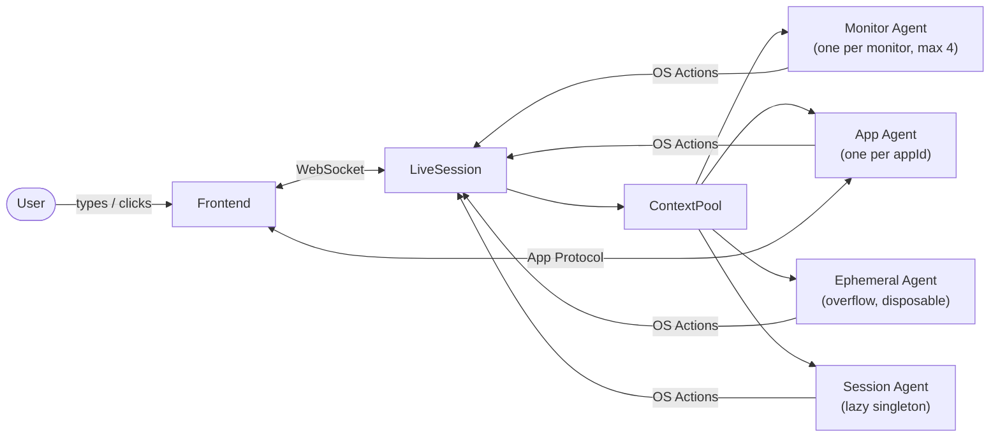
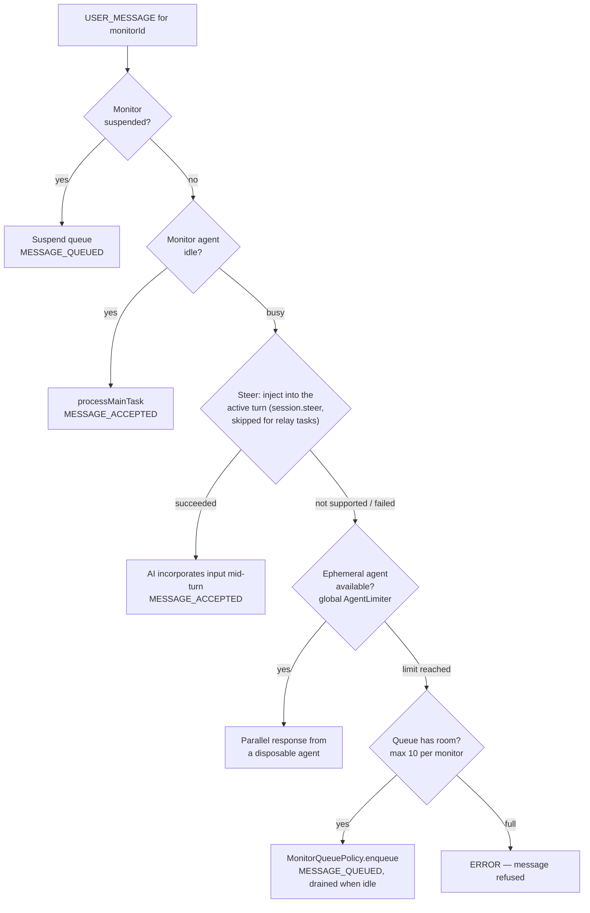
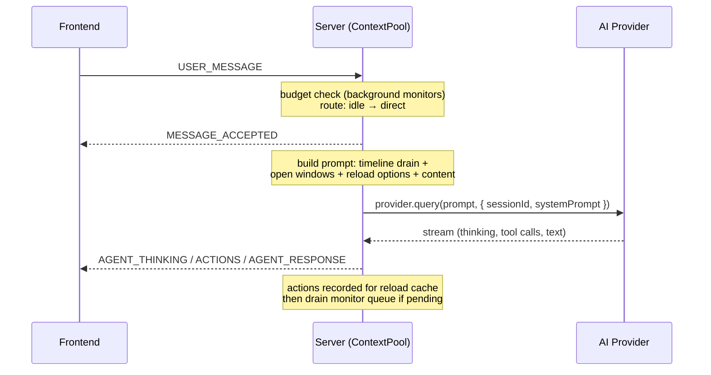
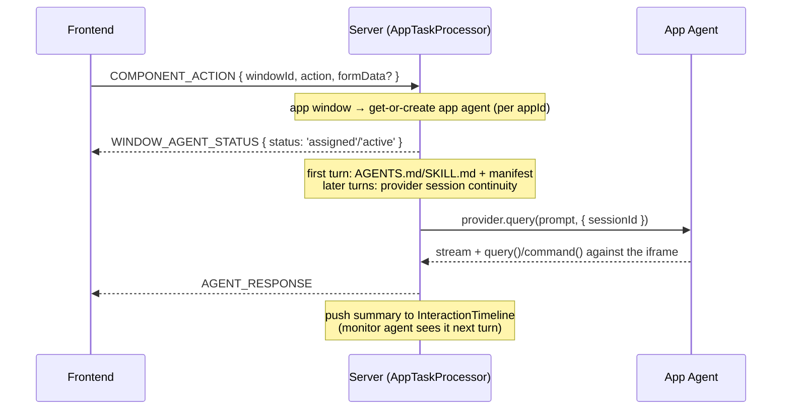
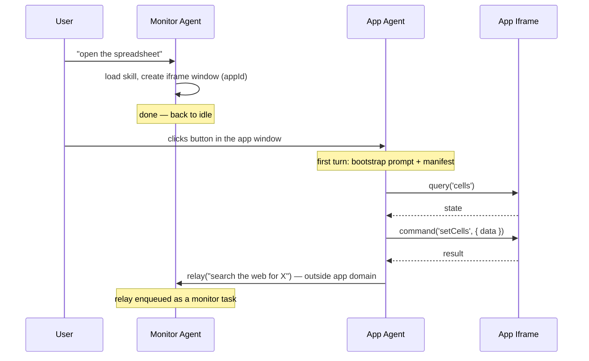
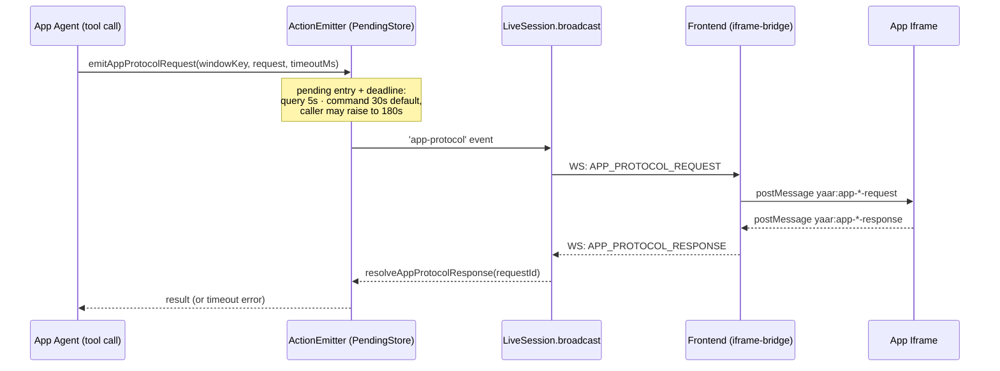
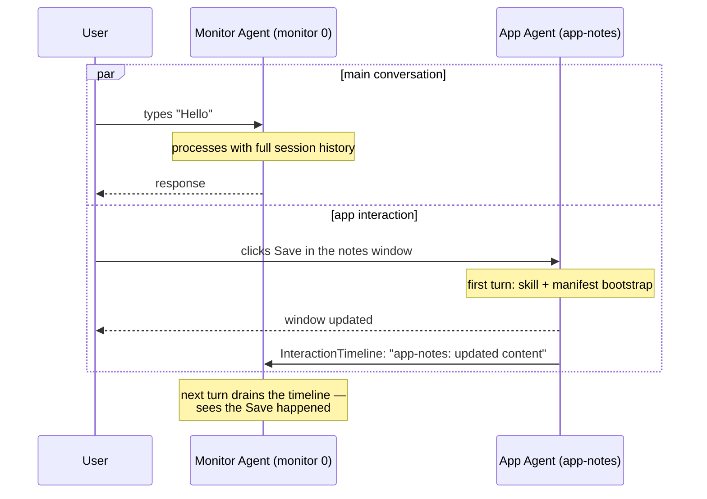

# Agent Architecture: Pools, Context, and Message Flow

> [한국어 버전](../ko/common_flow.md)

How YAAR manages concurrent AI agents through unified pooling, hierarchical context, and
policy-based orchestration. Diagrams are Mermaid — GitHub renders them natively.

## The Big Picture



Four agent tiers share one `AgentPool` inside the session's `ContextPool`. Every
server→frontend event flows through `LiveSession.broadcast()` (monitor-scoped routing via
`BroadcastCenter`).

## Agent Types

### 1. Monitor Agent — the orchestrator

The persistent generalist handling the main conversation flow, one per monitor
(primary `0` pre-warmed at connect; others auto-created on demand, `MAX_MONITORS = 4`).

- **Role**: `main-{monitorId}-{messageId}` (set per-message); canonical ID `main-{monitorId}`
- **Session**: resumes the same provider session across messages — full conversation history
- **Tools**: windows, notifications, storage read/list, memory, skills, config hooks,
  cache replay, and delegation (Claude's Task tool; app messaging via
  `invoke('yaar://windows/{id}', { action: "message", ... })`, optionally with
  `hook: "response"` to get the app agent's answer back)
- **URI**: `yaar://agents/{instanceId}`

It understands user intent and dispatches: trivial things (a notification, opening a window,
`reload_cached` replay) it does itself in 1–2 tool calls; app-domain work goes to app agents;
heavier research/build work goes to provider subagents. This keeps its own turns short so it
stays responsive to the next message.

### 2. Ephemeral Agent — overflow

Spawned when the monitor agent is busy and steering fails. Fresh provider, **no conversation
history** (receives open windows + reload options + the task), disposed right after the task;
its actions land in the `InteractionTimeline` for the monitor agent's next turn.

- **Role**: `ephemeral-{monitorId}-{messageId}`; limited by the global `AgentLimiter`

### 3. App Agent — the specialist operator

A persistent agent per `appId` (all windows of one app share it, surviving window close/reopen),
created on first interaction with an app window and routed through `AppTaskProcessor`.

- **Role**: `app-{appId}-{messageId}`; canonical ID `app-{appId}`
- **Context**: first turn bootstraps with the app's prompt (`AGENTS.md` replaces the generic
  prompt, else `SKILL.md` appends to it) + `protocol.json` manifest; later turns reuse the
  provider session
- **Tools** (scoped by design):

| Tool | Purpose |
|------|---------|
| `describe(appId?)` | Read an app's protocol manifest (own window, or another app's) |
| `query(stateKey?, appId?)` | Read iframe state — omit key for the manifest |
| `command(command, params?, appId?)` | Execute an iframe action |
| `relay(message)` | Hand off anything outside the app's domain to the monitor agent |
| `direct_message` | Only when `app.json` declares `"messaging": "all"` |

Passing another app's `appId` to `describe`/`query`/`command` is **cross-app control**, gated by
the caller's `app.json` `controls` list (bundled apps only) — e.g. devtools declares
`"controls": ["browser-user"]` to drive the real browser directly.

### 4. Session Agent — cross-monitor supervisor

A lazy singleton per session, created on first invocation via `yaar://session/agents/session`.
It is the **exclusive principal for `yaar://session/*`** (enforced centrally in
`ResourceRegistry.execute()`; monitor/app agents get a 403) — including
`yaar://session/browser`, the only door to the user's real Chrome.

- **Role**: `session-{action}-{timestamp}`; provider session continuity across invocations
- **Tools**: verb tools only (describe/read/list/invoke/delete) — no WebSearch, no Task
- **No monitor, no windows** — communicates via tool results and relay messages

> There is no separate "Task Agent" tier in the pool. Delegated research/code work runs as
> provider-internal subagents (Claude's Task tool) inside the monitor agent's turn; they never
> appear in `AgentPool`.

## Message Flow

### User message → monitor agent

`MonitorTaskProcessor` tries strategies in order:



Direct processing, end to end:



### Interaction with an app window → app agent

`COMPONENT_ACTION` / `WINDOW_MESSAGE` on a plain window goes to the monitor agent's queue;
on an app window it goes to `AppTaskProcessor`:



## Monitor Agent ↔ App Agent: Division of Responsibility

The monitor agent is the **generalist** that knows the user and conversation; app agents are
**specialists** that know their app's internal state and commands.

| | Monitor agent | App agent |
|---|---|---|
| Knows | full conversation, all windows on its monitor, app catalog, system state | app manifest (state keys + commands), app skill, its own interaction history |
| Doesn't know | app-internal state (cells, URLs, slides), app protocol mechanics | other windows, the broader conversation, web/code tools |
| Escape hatch | messages the app window (`action: "message"`, optional `hook: "response"`) | `relay()` back to the monitor agent |



## App Protocol: How an Agent Talks to an Iframe

Apps register a self-describing contract — state keys to query, commands to invoke — by calling
`app.register(manifest)` from `@bundled/yaar` when the iframe loads. The server stores readiness
**per window key** in `WindowStateRegistry`; `query`/`command` wait up to 5s for registration
(`requireAppReady`) before failing.



Windows are addressed by their **monitor-scoped key** (`win.id`), never the raw AI-facing id: the
same app open on two monitors shares a raw id, and the frontend resolves raw ids by whichever
monitor the *user* is viewing. The built-in `__console` state key is answered by the injected
protocol script and works even before `app.register()`.

## ContextTape: Hierarchical Message History

Messages are tagged with a URI source for hierarchical tracking:

```typescript
type ContextSource = `yaar://monitors/${string}` | `yaar://windows/${string}`;

interface ContextMessage {
  role: 'user' | 'assistant';
  content: string;
  timestamp: string;
  source: ContextSource;
}
```

- **Monitor agent prompts** don't inject the tape (provider session continuity carries history)
- **Window close** prunes that window's messages from the tape
- **Session restore** rebuilds the tape from a previous session's JSONL log
- Monitor history is capped (~200 messages, pruned to the most recent half)

## InteractionTimeline

A chronological timeline interleaving user events and agent action summaries. The monitor agent
drains it at the start of its next turn to see everything that happened while it was idle —
window closes, app agent runs, ephemeral agent runs.

```
User closes window → pushUser({ type: 'window.close', windowId })
App agent runs     → pushAI(role, task, actions, windowId)
Ephemeral agent    → pushAI(role, task, actions)

Monitor agent's turn → timeline.format() → drain()   // atomic, no gap
  <timeline>
  <ui:close>settings-win</ui:close>
  <ai agent="app-notes">Updated content of "notes".</ai>
  </timeline>
```

## Concurrency Example



Monitor and app agents run genuinely in parallel; the timeline is what keeps the orchestrator's
picture of the desktop consistent afterward.

### App state across app-agent handoffs

Immediately before an app agent is released, YAAR reads every state key declared by that
app's App Protocol and retains one aggregate fingerprint. Before the next invocation, it
reads the same declared state again and compares the fingerprints. The new prompt receives
only `<app_state_since_handoff changed="true|false" />`; app data itself is not copied into
the prompt. A changed agent can query the authoritative state it needs.

This detects user edits, timers, and any other app-state mutation without waking an idle
agent or requiring the app to emit an event. It reports a net state change, not an event
history: a value changed and then restored before the next invocation compares unchanged.

`app.sendInteraction()` remains instruction delivery. It invokes an idle app agent or steers
the active turn; it is not accumulated as handoff state.
