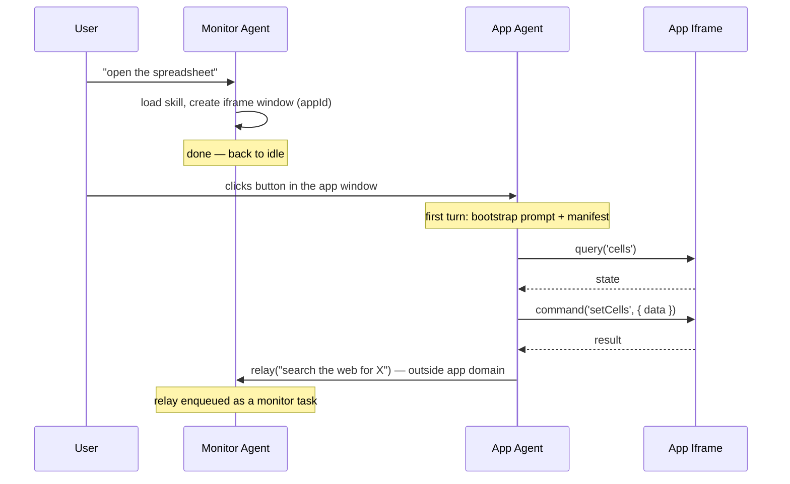
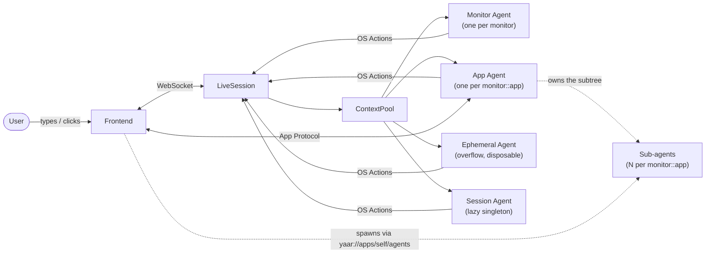
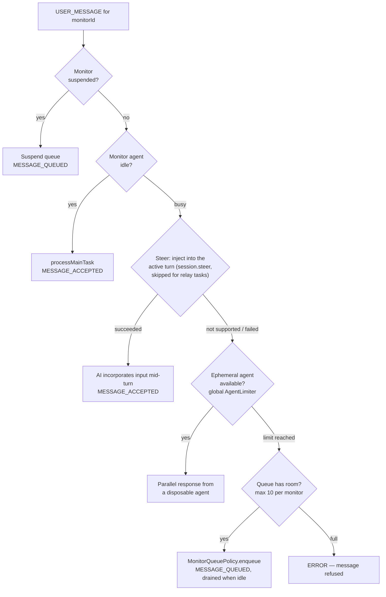
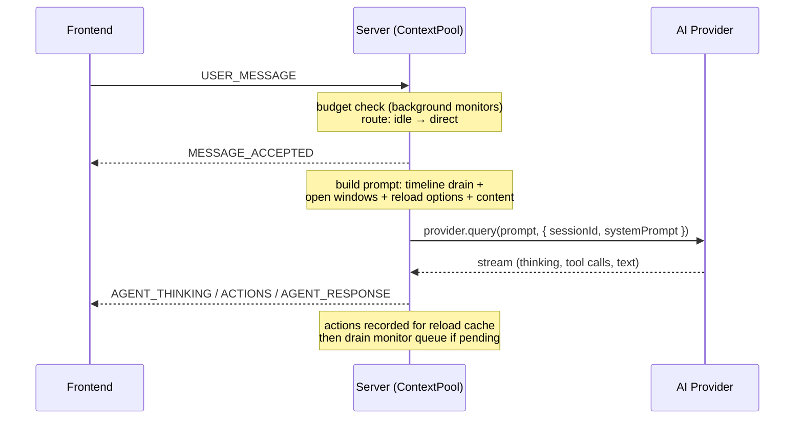
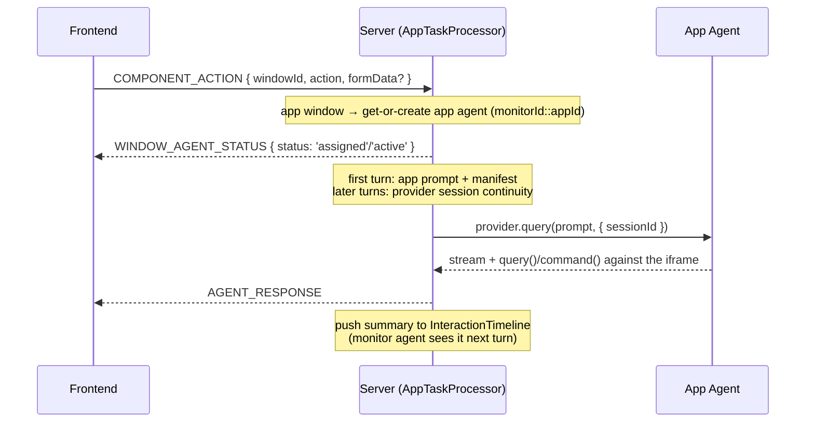
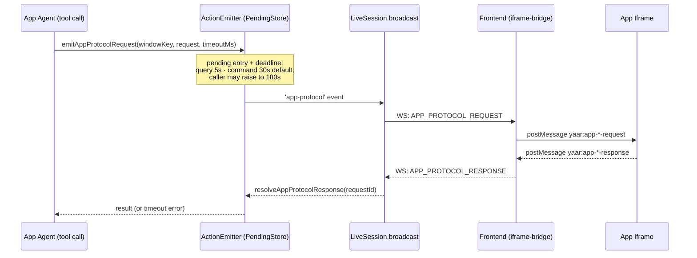
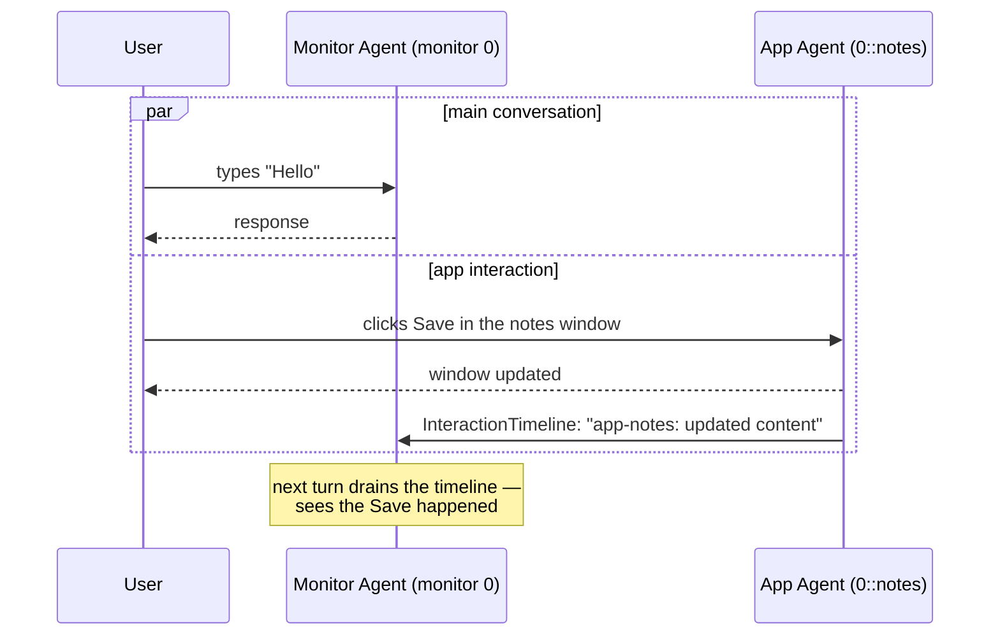

# Core Concepts: Session, Monitor, Window — and the Agents That Run Them

YAAR's runtime is three nested places — **session → monitor → window** — and a tree of agents
that lives in them — **session agent → monitor agent → app agent → sub-agent**. The two
hierarchies line up: each agent tier is anchored to one of the places, and dies with it.

```
Session ─────────────────────────────── Session Agent        (lazy singleton, the session principal)
├── Monitor 0 ("Desktop 1") ─────────── Monitor Agent 0      (persistent, sequential)
│   ├── Window "notes"   (app) ──┐
│   ├── Window "notes-2" (app) ──┴───── App Agent 0::notes   (one per app per monitor)
│   │                                   └── Sub-agents       (0..N, spawned by the app's iframe)
│   ├── Window "report"  (markdown) ─── handled by Monitor Agent 0
│   └── CLI history
├── Monitor 1 ("Desktop 2") ─────────── Monitor Agent 1      (independent context)
│   ├── Window "notes"   (app) ──────── App Agent 1::notes   (disjoint from 0::notes)
│   └── CLI history
└── Event log (session_logs/…/messages.jsonl)
```

This document explains the places first, then the agents, then how a message moves between
them. Precise schemas live in the references: [URI & Verb Reference](../reference/uri_reference.md),
[OS Actions Reference](../reference/os_actions_reference.md),
[App Protocol Reference](../reference/app_protocol_reference.md). For how all of this maps onto
OS concepts, see the [OS Architecture Map](./os_architecture.md).

All paths are relative to `packages/server/src/` unless noted.

---

## Session

A **session** is the top-level container for one complete conversation. It owns all state — agents, windows, monitors, context history, and the on-disk log. Sessions survive individual WebSocket disconnections: the session is about *persistence*, not about any one browser tab.

The `yaar://` URI scheme is implicitly scoped to the current session — `yaar://` *is* the session root. The session itself is addressable as `yaar://session`.

### Multi-connection

Multiple browser tabs can share one session. When a tab connects with `?sessionId=X`, the server looks up the existing `LiveSession` (`session/live-session.ts`, registered in the singleton `SessionHub`) instead of creating a new one. All connections receive the same agent output via `BroadcastCenter`.

```
Tab 1 ──┐
Tab 2 ──┼──> LiveSession(ses-123) ──> ContextPool, WindowState, ...
Tab 3 ──┘
```

### Lifecycle

1. **First connection** — no `?sessionId` param. Server creates a new `LiveSession` and sends `CONNECTION_STATUS { sessionId }`; the frontend stores it for reconnection.
2. **Reconnection** — frontend passes `?sessionId=X`; server returns the existing session and the new client gets a snapshot of current windows.
3. **Lazy init** — the expensive `ContextPool` (agents, provider) isn't created until the first message. This keeps `/health` fast.
4. **Persistence** — `SessionLogger` writes everything to `session_logs/{sessionId}/messages.jsonl`; sessions are browsable and restorable from those logs.

---

## Monitor

A **monitor** is a virtual desktop workspace within a session (up to `MAX_MONITORS` = 4; 2 on Android while its child-process restrictions are on). Think Linux workspaces or macOS Spaces — each monitor holds an independent set of windows and runs its own monitor agent.

### Why monitors exist

Monitors enable parallel, independent AI workflows: a long background task can run on Monitor 2 while the user keeps interacting on Monitor 1. Each monitor has its own monitor agent (with its own provider session), its own sequential main queue, its own CLI history, and its own windows. Monitors are addressed as `yaar://session/monitors/{id}`; suspend/resume/interrupt controls are listed in the [URI & Verb Reference](../reference/uri_reference.md).

### Who owns what

**The session owns the monitor list; a connection owns which monitor it is looking at.**

`LiveSession.monitors` is authoritative. The server mints the ids (`ADD_MONITOR` → lowest unused integer) and broadcasts the list (`MONITORS`) on attach and on every change; the frontend renders it. It used to be per-tab state minted from a per-tab counter, so two tabs each made a monitor `"1"`, collided on one server-side agent, and neither saw the other's.

`activeMonitorId` lives only in the frontend store, one per tab, and is mirrored server-side as the connection's single `BroadcastCenter` subscription (replace-on-set). The server has no session-wide "active monitor" — a session has N connections, so one such field is a category error, and it was last-writer-wins between tabs.

### The server never invents a monitor id for routing

For a **window-scoped** event (`WINDOW_MESSAGE`, `COMPONENT_ACTION`, any `window.*` action) the monitor comes from the window — `WindowStateRegistry.getMonitorForWindow`. For a **user-scoped** event it comes from the connection that sent it. On the routing path, a task or action whose monitor cannot be resolved throws (`requireMonitorId`, `ActionEmitter.resolveWindowMonitor`) rather than guessing. Guessing is what made a click in a window on monitor 1 run on monitor 0's agent and open its windows there. The findings behind the rule, and the tests that pin it, are in `tests/monitor-identity.test.ts`.

This is a routing-path guarantee, not a claim that `'0'` never appears anywhere. `DEFAULT_MONITOR_ID` (`'0'`) is a real, live fallback for *display* purposes on the frontend — e.g. `(w.monitorId ?? DEFAULT_MONITOR_ID)` in `packages/frontend/src/store/selectors.ts` and `desktop.ts`, and in the server's monitor registry, which seeds `monitors[0]` as `DEFAULT_MONITOR_ID` (`session/monitor-registry.ts`). Those are initialization/rendering defaults, not routing guesses.

Monitor-scoped events (`USER_MESSAGE`, `ACTIONS`, `AGENT_THINKING`, `AGENT_RESPONSE`, `TOOL_PROGRESS`) carry a `monitorId` for routing.

---

## Window

A **window** is an AI-generated rectangular UI surface on the desktop. Windows are not pre-built screens — they are created and controlled entirely by the AI through OS Actions. Agents address them as `yaar://windows/{windowId}`; the monitor is inferred from the agent's context.

A window carries an id, title, bounds, a lock state, and — the interesting part — a `content` payload of `{ renderer, data }`. Renderers are pluggable: `markdown`, `html`, `text`, `table`, `iframe`, and `component` (a flat Component DSL — no recursive nesting, CSS-grid layout — designed so an LLM can emit it reliably). The frontend extends this with pure UI state (minimized/maximized, z-order). Full renderer payload shapes are in the [OS Actions Reference](../reference/os_actions_reference.md).

An **app window** is an `iframe` window running one of the apps in `apps/`. It is the window kind that gets its own agent (below) and speaks the App Protocol.

### Subscriptions and locking

Agents can subscribe to another window's changes (`action: 'subscribe'`, events like `content`, `interaction`, `close`); the subscriber receives a synthetic `<window:change>` message when the target changes. Updates are debounced (500ms), an agent's own writes don't trigger its own subscription, and subscriptions are cleaned up on window close or agent disposal.

Locking prevents concurrent modification: `window.lock(windowId, agentId)` makes the window writable only by that agent until it unlocks.

### Lifecycle summary

```
AI emits window.create action
  → Server: WindowStateRegistry records it, BroadcastCenter sends to all connections
  → Frontend: added to store, rendered by WindowManager in z-order

User interacts (drag, resize, click button, close)
  → Frontend: local state updated immediately
  → Server: routed to monitor agent (or app agent for app windows), recorded in InteractionTimeline

AI emits window.close / user clicks X
  → Frontend: removed from store
  → Server: subscriptions cleared, context pruned, reload cache invalidated;
    the app's last window on a monitor also retires that app agent and its sub-agents
```

`WindowStateRegistry` (in `LiveSession`) is the server's own view of every open window — agents inspect what's on screen via `list('yaar://windows/')` / `read('yaar://windows/{id}')` without asking the frontend.

---

## Agents

### The shape

All agents share one `AgentPool` inside the session's `ContextPool`, and they form an ownership
tree:

```
session agent                      (1 per session)            cross-monitor oversight
└─ monitor agent                   (per monitor)              the desktop's hands
   └─ app agent                    (per monitor::app)         the process's main thread — the principal
      └─ sub-agents                (per monitor::app::subId)  worker threads — no principal
```

Each tier's pool key extends its owner's (`monitorId` → `monitorId::appId` →
`monitorId::appId::subId`), each tier is addressed *through* its owner, and disposal cascades
downward. In the OS metaphor: processes got threads.

| Tier | Key | Prompt provenance | Capabilities | Spawned by |
|---|---|---|---|---|
| session | (singleton) | constant | verb tools; the only `yaar://session/*` principal | first invocation of `yaar://session/agents/session` |
| monitor | `monitorId` | constant + `agent/hint.md` injections | monitor toolset | monitor creation |
| app | `monitorId::appId` | install-time disk (shared intro + `agent/prompt.md` if shipped, + manifest) | `describe`/`query`/`command`/`relay` (+`direct_message`, +`controls`), the app principal | first window interaction |
| sub-agent | `monitorId::appId::subId` | **runtime, verbatim** | one channel to its own app's iframe under app-declared tool names — or nothing at all | the owning app, via `yaar://apps/self/agents` |

`list('yaar://session/agents')` returns both views of this — `agents` flat and `tree` nested. A
`tree` node with `id: null` is a vacant owner slot: ownership follows the key, not the instance,
so an app's sub-agents hang under `monitorId::appId` whether or not that app ever grew an agent
of its own.

Agents carry a **principal `role`** (`session` / `monitor` / `app`) that access control is keyed
on, enforced centrally in `ResourceRegistry.execute()` (`agents/roles.ts` maps a role prefix onto
a tier).

### Session agent — cross-monitor supervisor

A lazy singleton per session, created on first invocation via `yaar://session/agents/session`.
It is the **exclusive principal for `yaar://session/*`** (monitor/app agents get a 403) —
including `yaar://session/browser`, the only CDP door to the user's real Chrome
([Browser Automation](./browser_automation.md)).

- **No monitor, no windows** — communicates via tool results and relay messages only
- **Verb tools only** — the same 5 generic verbs as other agents; no WebSearch, no Task
- **Role**: `session-{action}-{timestamp}`; provider session continuity across invocations

Its invoke actions (`audit`, `coordinate`, `query`) are listed in the [URI & Verb Reference](../reference/uri_reference.md).

### Monitor agent — the orchestrator

The persistent generalist handling the main conversation flow, one per monitor (primary `0`
pre-warmed at connect; a `USER_MESSAGE` carrying an unseen `monitorId` auto-creates the agent).

- **Role**: `main-{monitorId}-{messageId}` (set per-message); canonical ID `main-{monitorId}`
- **Session**: resumes the same provider session across messages — full conversation history
- **Tools**: windows, notifications, storage, memory, skills, config hooks, cache replay, and
  delegation (Claude's Task tool; app messaging via `invoke('yaar://windows/{id}', { action: "message", ... })`)
- **URI**: `yaar://agents/{instanceId}`

It understands user intent and dispatches: trivial things (a notification, opening a window,
`reload_cached` replay) it does itself in 1–2 tool calls; app-domain work goes to app agents;
heavier research/build work goes to provider subagents. This keeps its own turns short so it
stays responsive to the next message.

### App agent — the specialist operator

One per (monitor, app): every window of one app on one monitor shares it. It is created on the
first interaction with an app window, routed through `AppTaskProcessor`, and retired when the
app's **last window on that monitor** closes — or by the idle reaper after
`APP_AGENT_IDLE_MINUTES` (`agents/app-agent-registry.ts`). Two monitors running the same app get
two agents that cannot see each other's context.

- **Role**: `app-{appId}-{messageId}`; canonical ID `app-{appId}`; keyed `monitorId::appId`
- **Context**: the first turn bootstraps with the app's prompt (shared intro, plus
  `agent/prompt.md` if the app ships one) and its `protocol.json` manifest; later turns reuse the
  provider session — which is where the agent's memory lives, and why
  `{ action: "message", fresh: true }` (retire the agent, answer on a new one) is the way to
  start it over. Full prompt sourcing: [App Agent Prompt](../reference/app_agent_prompt.md).
- **Tools** — scoped by design to its own app: `describe`/`query`/`command` against the iframe's
  protocol, `relay` to hand anything outside the app's domain back to the monitor agent, and
  `direct_message` only when `app.json` declares `"messaging": "all"`
  (signatures: [App Agent Prompt](../reference/app_agent_prompt.md))

Passing another app's `appId` to `describe`/`query`/`command` is **cross-app control**, gated by
the caller's `app.json` `controls` list (bundled apps only) — e.g. devtools declares
`"controls": ["browser-user"]` to drive the real browser directly.

Tasks for one app on one monitor are serialized by `AppTaskProcessor` (a bounded queue per app
agent, steered into the running turn where the provider allows); different apps run in parallel.

### Sub-agents — the app's worker threads

N per (monitor, app), spawned by an app's **iframe** — not by any agent — when the app declares
`"subagents": { "max": N }` (the retired `"personas"` key refuses spawns). Each is a real provider session with its own memory and a system
prompt the app supplies *at runtime*, which is what lets one app run several distinct characters
concurrently instead of one agent role-playing them in turn. A "persona" is the tool-less case of
a sub-agent — the name survives because it is the shipped wire format, not because it is a
separate tier.

- **Role**: `app-persona-{appId}-{subId}`; keyed `monitorId::appId::subId`
- **Context**: none of YAAR's — sub-agents bypass `ContextPool` entirely (no tape, no queue; the
  app's own scheduler serializes their turns)
- **Tools**: no YAAR verbs, no permissions, no principal. At most, a named list of app-declared
  tools that resolves to one channel back into the app's own iframe (`mcp/sub-agent/`,
  `SubAgentToolSpec`, capped at `MAX_SUB_AGENT_TOOLS`)
- **URI**: addressed through its owner — `yaar://apps/self/agents/{personaId}`; streams at
  `yaar://agents/{instanceId}/stream`

Sub-agents are never interaction targets — a window click always goes to the app agent — only
explicit `message` targets. The verb surface is in the [URI & Verb Reference](../reference/uri_reference.md#app-sub-agents--yaarappsselfagents);
the how-to is in the [YAAR SDK Guide](../guides/yaar_sdk.md#sub-agents-personas).

### Ephemeral agents — overflow

The one node that predates the tree. Spawned only as a busy-monitor fallback
(`createEphemeral()`, called solely from `monitor-task-processor.ts`) when the monitor agent is
busy and steering fails: a fresh provider with **no conversation history** (it receives open
windows + reload options + the task), disposed right after the task; its actions land in the
`InteractionTimeline` for the monitor agent's next turn. Role `ephemeral-{monitorId}-{messageId}`.

In tree terms they are monitor-tier sub-agents with a degenerate capability set ("same as
owner"). They have a slot; folding them into it is opportunistic cleanup, not a pending
requirement.

> There is no "Task Agent" tier in the pool. Delegated research/code work runs as
> provider-internal subagents (Claude's Task tool; Codex's `CODEX_AGENT_ROLES`) inside the
> monitor agent's turn; they never appear in `AgentPool`.

### Monitor agent ↔ app agent: division of responsibility

The monitor agent is the **generalist** that knows the user and conversation; app agents are
**specialists** that know their app's internal state and commands.

| | Monitor agent | App agent |
|---|---|---|
| Knows | full conversation, all windows on its monitor, app catalog, system state | app manifest (state keys + commands), app skill, its own interaction history |
| Doesn't know | app-internal state (cells, URLs, slides), app protocol mechanics | other windows, the broader conversation, web/code tools |
| Escape hatch | messages the app window (`action: "message"`, optional `hook: "response"`, optional `fresh: true`) | `relay()` back to the monitor agent |



A monitor agent messages an app window with `invoke('yaar://windows/{id}', { action: 'message', ... })`;
the task takes the same queue path as a user interaction. It is fire-and-forget unless
`hook: "response"` asks for the answer back; combine with `subscribe` to learn when the app
agent finishes.

---

## The four laws

Every node below the session tier satisfies all four. A feature that can't is a different
feature.

1. **Ownership follows the key.** Every agent has exactly one owner, one tier up, and its pool
   key extends the owner's. Addressing goes through the owner (`yaar://apps/self/agents/{id}`),
   and *naming is not owning*: the appId in the URI must equal the appId the calling context
   says the caller is (`handlers/apps/agents-resource.ts`). An app cannot reach another app's
   sub-agents even if it declares that URI in its permissions — the permission list says what
   you may ask for, the ownership check says whose they are. Two monitors running the same app
   hold two disjoint subtrees.

2. **Descent never adds capability.** A child's capability set is a subset of its owner's, and
   each step down strips more than it keeps. The app agent holds the app's principal and its
   full toolset; a sub-agent holds no principal and, at most, a named subset of the protocol
   commands its owner could already issue — often nothing. Cross-app grants (`controls`,
   `direct_message`) never descend: they are grants to the process's main thread, not to the
   process.

3. **Prompts descend toward runtime; capabilities stay at install time.** Going down the tree
   the system prompt becomes progressively more caller-supplied — session and monitor prompts
   are YAAR's constants, the app agent's comes off disk at install, a sub-agent's arrives
   verbatim at spawn. Capabilities move the *opposite* way: they are a fixed menu written once
   in `agents/profiles/`, **selected** at spawn, never composed there. This is why overriding a
   prompt at runtime is safe — the hands are not overridable. A runtime string chooses from a
   menu; it never writes the menu.

4. **Lifecycle cascades down.** Disposing an owner disposes its subtree: removing a monitor
   tears down its app agents and their sub-agents; an app's last window on a monitor closing
   tears down that app agent *and* its sub-agents — the same condition, spent on both tiers at
   once, because "the app has left this desktop" is one fact. (Closing a window the app still
   has siblings of takes nothing: the agent is keyed by `monitor::app` and is driving them.)
   No node outlives its owner and none survives the session. Durable identity is app data
   (`appDb`/`appStorage`), replayed into a fresh node's first turn.

### Placing a new node

When a request arrives for a new kind of agent ("can my app have a judge with read access?",
"can the monitor spawn helpers?"), answer by finding a slot in the tree rather than designing a
new pool tier:

1. **Which tier owns it?** If no existing tier can own it, the request is for a new *owner*
   tier, which is a much larger change than it usually sounds like.
2. **Is its capability set a strict subset of that owner's?** If not, law 2 says stop — the
   thing being asked for is an escalation, and escalations belong to the owner tier, not to a
   new child.
3. **Can its capabilities be written once in `agents/profiles/` and merely selected at spawn?**
   If the caller needs to *compose* capabilities, law 3 says no.
4. **Does it die with its owner?** If it needs to outlive one, it is storage, not an agent.

Sub-agents spawning sub-agents is the other thing that doesn't exist: the tree is four tiers
deep, not N, because a node spawning its own children is an escalation ladder with no owner
semantics.

If a case ever genuinely needs real YAAR verbs in a sub-agent's hands — everything asked for so
far ("read my own state", "operate my own window") has been expressible as an app-defined tool
with the iframe as executor instead — that is a different animal from what's shipped: a user
permission prompt at first spawn, a per-verb subset of the app agent's toolset, and its own
design doc. Do not build it for symmetry.

### Why a tree instead of more tiers

One new pool tier per capability need would each add a map, a verb surface, and a teardown hook.
Two alternatives were rejected:

- **Multiple app agents with prompt overrides.** Keying is identical either way, so the map is
  not the cost. The cost is that tool-lessness becomes a runtime flag on a shared type, checked
  at four sites (allowlist derivation, `AppTaskProcessor` routing, prompt assembly, restore
  filtering) instead of nailed shut in one profile. The tree keeps the distinction structural.
- **Caller-chosen YAAR tools at spawn.** Maximal flexibility, and exactly the escalation surface
  law 3 exists to prevent: a runtime-supplied prompt that also picks which YAAR verbs it gets is
  a confused-deputy factory. Rejected permanently, not deferred. What *is* selectable at spawn is
  a named tool list that resolves to one channel back into the app's own iframe — never a YAAR
  verb, `relay`, `direct_message`, or `controls`.

### Budgets

`MAX_AGENTS` (default 10) is one global semaphore (`AgentLimiter`) over every node with a
provider process; a spawn over the limit is refused, never queued. Each tier also budgets its
own children: the session caps monitors (`MAX_MONITORS`), and an app's `subagents.max` caps its
sub-agents (itself clamped to `MAX_SUB_AGENTS_PER_APP`, 16).

Because sub-agents hold no YAAR tools they are materially lighter than an agent with hands, so
they currently compete for slots they don't really cost — a 4-character room spends 7 slots
against one pool. Splitting the global semaphore (`MAX_AGENTS` for principal-holding tiers, a
larger ceiling for sub-agent nodes) is the known fix and is unstarted.

---

## Message flow



Every server→frontend event flows through `LiveSession.broadcast()` (monitor-scoped routing via
`BroadcastCenter`).

### User message → monitor agent

`MonitorTaskProcessor` tries strategies in order:



Direct processing, end to end:



### Window interaction → which agent

Window interactions (`COMPONENT_ACTION`, `WINDOW_MESSAGE`) route by window type:

- **Plain windows** (markdown, table, component, …) → the **monitor agent** for the window's
  monitor. It has the full conversation context.
- **App windows** → the (monitor, app) **app agent** via `AppTaskProcessor`.



### App Protocol: how an agent talks to an iframe

Apps register a self-describing contract — state keys to query, commands to invoke — by calling
`defineApp({...})` from `@bundled/yaar` when the iframe loads. `query`/`command` wait for
registration (`requireAppReady`) before failing, then travel as a pending request:



Windows are addressed by their **monitor-scoped key**, never the raw AI-facing id: the same app
open on two monitors shares a raw id, and the frontend resolves raw ids by whichever monitor the
*user* is viewing. Full protocol: [App Protocol Reference](../reference/app_protocol_reference.md).

---

## Context: what each agent remembers

### ContextTape

Every message is tagged with the URI it came from — a monitor (`yaar://monitors/…`) or a window
(`yaar://windows/…`) — so history can be pruned and injected per source (`agents/context.ts`).

- **Monitor agent prompts** don't inject the tape (provider session continuity carries history)
- **Window close** prunes that window's messages from the tape
- **Session restore** rebuilds the tape from a previous session's JSONL log, and the new
  launch's log starts with that restored state copied in (`restored: true` entries,
  `metadata.restoredFrom`, carried-over `threadIds`). Each log can therefore be restored on its
  own, however many restarts are chained
- Monitor history is capped (~200 messages, pruned to the most recent half)

### InteractionTimeline

A chronological timeline interleaving user events and agent action summaries
(`agents/interaction-timeline.ts`). The monitor agent drains it at the start of its next turn to
see everything that happened while it was idle — window closes, app agent runs, ephemeral agent
runs.

```
User closes window → pushUser({ type: 'window.close', windowId })
App agent runs     → pushAI(role, task, actions, windowId)
Ephemeral agent    → pushAI(role, task, actions)

Monitor agent's turn → timeline.format() → drain()   // atomic, no gap
  <timeline>
  <ui:close>settings-win</ui:close>
  <ai agent="app-notes">Updated content of "notes".</ai>
  </timeline>
```

Monitor and app agents run genuinely in parallel; the timeline is what keeps the orchestrator's
picture of the desktop consistent afterward:



### App state across app-agent handoffs

Immediately before an app agent is released, YAAR reads every state key declared by that app's
App Protocol and retains one aggregate fingerprint (`agents/app-state-handoff.ts`). Before the
next invocation, it reads the same declared state again and compares. The new prompt receives
only `<app_state_since_handoff changed="true|false" />`; app data itself is not copied into the
prompt. A changed agent can query the authoritative state it needs.

This detects user edits, timers, and any other app-state mutation without waking an idle agent
or requiring the app to emit an event. It reports a net state change, not an event history: a
value changed and then restored before the next invocation compares unchanged.
`app.sendInteraction()` remains instruction delivery — it invokes an idle app agent or steers the
active turn; it is not accumulated as handoff state.

---

## How it fits together

```
Session (1 per conversation)
 ├── owns SessionHub registration, SessionLogger
 ├── has 0–1 Session Agent (lazy; the only yaar://session/* principal)
 ├── has 1–4 Monitors (defaults to 1)
 │    ├── each has 1 Monitor Agent (persistent, sequential within monitor)
 │    ├── each has N Windows (AI-created, user-interactable)
 │    ├── each has 0–N App Agents (one per app with a window here)
 │    │    └── each has 0–N Sub-agents (spawned by the app's iframe)
 │    └── each has its own CLI history
 ├── has 1 WindowStateRegistry (tracks all windows across all monitors)
 ├── has 1 ReloadCache (fingerprint-based action caching)
 └── supports N WebSocket connections (multi-tab)
```

---

## Key files

| Concern | File |
|---|---|
| Session aggregate root, connections | `session/live-session.ts`, `session/session-hub.ts` |
| Monitor list, ids, subscriptions | `session/monitor-registry.ts` |
| Window state | `session/window-state.ts` |
| Task orchestration | `agents/context-pool.ts`, `agents/monitor-task-processor.ts`, `agents/app-task-processor.ts`, `agents/session-task-processor.ts` |
| The tree, keys, spawn/dispose | `agents/agent-pool.ts`, `agents/agent-roster.ts` (`buildAgentTree`) |
| App-agent tier (reuse, idle reaper) | `agents/app-agent-registry.ts` |
| Sub-agent tier | `agents/sub-agent-registry.ts`, `agents/profiles/sub-agent.ts` (what a sub-agent can touch — the one place), `mcp/sub-agent/` |
| Sub-agent verb surface + ownership check | `handlers/apps/agents-resource.ts` |
| `persona:` command convention (hidden from the app agent); `subagents` manifest parsing | `features/apps/persona-commands.ts`, `features/apps/manifest.ts` |
| Roles → access tiers | `agents/roles.ts`, `handlers/uri-registry.ts` |
| Context and timeline | `agents/context.ts`, `agents/interaction-timeline.ts`, `agents/app-state-handoff.ts` |
| Window-close teardown | `agents/window-event-coordinator.ts` |
