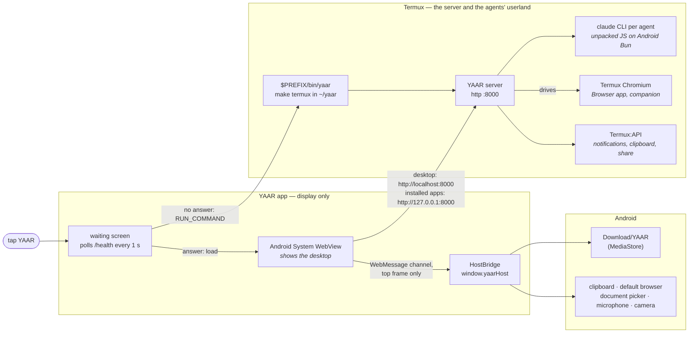

# YAAR on Android

**Source:** `hosts/android/` (`MainActivity.java`, `HostBridge.java`, `KeepAliveService.java`, `DesktopWebView.java`, `Termux.java`), `scripts/dev/start-termux.sh`, `scripts/dev/termux-open-desktop.sh`, `scripts/dev/ensure-claude-android.sh`, `scripts/dev/unbun-claude.ts`, `packages/server/src/features/android/`, `packages/server/src/features/companion/`, `packages/server/src/launcher-watchdog.ts`, `packages/server/src/desktop-window/host-bridge.ts`, `scripts/codegen/android-host-script.ts`

This page describes how YAAR is put together on an Android phone: which processes run where,
what the launcher does, what happens when you tap the app, and what the app's window does that
a browser tab doesn't. To install it, follow the [Termux guide](../guides/termux.md). The work
still to do on Android is in the
[WebView host proposal](../proposals/webview_host_proposal.md#4-android-what-is-left).

> **Status (2026-09-29).** The host APK is verified against a server on a PC, on an API 35
> emulator and on a Galaxy S25 (Android 16, WebView 153). Releases carry it as
> `yaar-android.apk` once the release key is in CI's secrets, and none has shipped yet. The
> cold start below has not run with a server in the phone's own Termux.

## The shape of it

On a phone, YAAR is two apps. **Termux** runs the server and everything the agents run. The
**YAAR app** (`io.github.sorryhyun.yaar`) is only the display: one Android WebView showing the
desktop at `http://localhost:8000/`, with a `window.yaarHost` that saves files, reads the
clipboard and opens links the way a phone app does. Without the YAAR app, the desktop opens in
Chrome instead, and everything on the Termux side is the same.



What each piece does:
- **Termux** holds the server and everything the agents run: bash, git, coreutils, curl.
  That is why the server is not in the APK. An APK that carried it would be rebuilding Termux.
- **The YAAR app** owns the window and nothing else. If it is closed, the server keeps
  running. If the server is not running, the app waits for it and can start it.
- **Android System WebView** is the app's renderer. It is Chromium, updated through the Play
  Store, not something YAAR ships.

### What lives where

| Where | What it is | Written by |
|---|---|---|
| `~/.bun/bin/bun` | Bun's Android build (`bun-linux-aarch64-android`). The build the bun.sh installer picks does not run on Android | install.sh |
| `~/yaar` | A git checkout of the release tag, with its `node_modules` | install.sh |
| `$PREFIX/bin/yaar` | The launcher: `cd ~/yaar && make termux` | install.sh |
| `~/.shortcuts/YAAR` | The same launcher, as a Termux:Widget button | install.sh |
| `~/.cache/yaar/claude-js/<sdk-version>-<arch>/` | Claude Code, unpacked for Android, and a `claude` wrapper | `ensure-claude-android.sh`, from install.sh or the first launch |
| `~/.claude/` | The Claude login | `claude auth login`, from the first launch |
| `$PREFIX/bin/pdfinfo`, `pdftocairo`, `pdftotext` | poppler, for reading PDFs and for drawing their pages in a window (Chrome on Android has no inline PDF viewer) | install.sh (`pkg install poppler`) |
| `$PREFIX/bin/chromium-browser` | Termux's Chromium (`x11-repo`), for the companion desktop and the Browser app | install.sh (`pkg install chromium`) |
| The YAAR app, `io.github.sorryhyun.yaar` | The display: one activity, about 5.5 MB | Android's installer, offered by install.sh ([Installing the app](#installing-the-app)) |
| `/data/data/io.github.sorryhyun.yaar/` | The WebView's own storage (localStorage, IndexedDB, service worker, HTTP cache), private to the app | the WebView |
| `Download/YAAR/` | What you save from the desktop | the YAAR app and DownloadManager |

The server's own state (`storage/`, `config/`, `session_logs/`) is inside `~/yaar`, as in any
source checkout.

---

## The Termux side

### Why there is no release binary

The release binaries are glibc builds, and Android's linker refuses them. So on Termux,
install.sh builds from source: Bun's Android build, a checkout of the release tag, and
`bun install`. An update is another run of install.sh, which moves the checkout to the new tag.

### Why Claude Code has to be unpacked

The Agent SDK ships `claude` as glibc and musl executables, and Android's linker refuses both
(`unexpected e_type: 2`). Those executables are Bun single-file builds, though, and the
JavaScript inside is stored as source next to its bytecode.

`ensure-claude-android.sh` downloads the SDK's linux package from npm (about 220 MB), and
`unbun-claude.ts` extracts its module graph into a plain directory. A small `claude` wrapper
runs its `cli.js` on the Android Bun, and `CLAUDE_CODE_PATH` points at the wrapper. The result
is cached per SDK version and architecture, so this runs again only when the SDK is bumped.

install.sh runs it so the big download happens while you are already waiting on an installer.
The launcher runs it too, so a checkout whose SDK has moved since still starts.

### What `yaar` does

`yaar` runs `make termux`, which is `scripts/dev/start-termux.sh`. In order:

1. **Checks Bun.** A Bun that does not run means it is not the Android build.
2. **Stays single-instance.** It writes `$TMPDIR/yaar-termux.pid`. If a live launcher already
   owns it, this one opens that server's desktop and exits. A second server would take the
   next port, and the first one's exit would release the wake lock under it.
3. **Reinstalls when `bun.lock` has moved** since the last install. `git pull` alone would
   leave the old SDK in `node_modules`, and with it the old unpacked Claude Code.
4. **Finds Claude Code.** A `CLAUDE_CODE_PATH` from the shell profile is used only if it is at
   least the version the SDK was built against. An older CLI fails every turn with a bare 400
   once it is asked for a model it does not know. Otherwise, the unpacked build.
5. **Logs in.** With no credentials and no `CLAUDE_CODE_OAUTH_TOKEN`, it runs
   `claude auth login` in the terminal. Without a terminal (started from the YAAR app or a
   widget), it exits and says to run `yaar` in Termux.
6. **Opens the desktop** once the server answers, through `termux-open-desktop.sh`
   ([below](#where-the-desktop-opens)).
7. **Takes the wake lock** (`termux-wake-lock`, part of Termux itself). Without it, Android
   dozes Termux within minutes of the screen going off. It is released when the launcher
   exits.
8. **Starts the server** with `start.sh claude` and these settings:

| | Desktop | `make termux` |
|---|---|---|
| Providers | Claude, Codex | Claude only |
| Remote mode | `REMOTE=1` / settings toggle | Always off: `REMOTE=0`, even over a `REMOTE=1` in your shell profile. Client and server are the same device |
| MCP auth | On (except `*-dev` targets) | Skipped (`MCP_SKIP_AUTH=1`) |
| File watcher | `bun --watch` | Off (`NO_WATCH=1`), so a `git pull` under a running YAAR does not restart it and drop every agent |
| React build | Development (dev server) | Production. The dev build doubled render cost on the phone shell (`YAAR_REACT_PROD`) |
| Companion desktop | Off | On, when Chromium is installed |
| Layout | Desktop | The phone shell, chosen by the browser's own media query (coarse pointer, narrow window) |

### How the server ends

`start.sh` runs the server in a process group of its own, and a launcher on Android usually dies by SIGKILL (Termux, the phantom-process killer), which skips `start.sh`'s cleanup trap. So the launcher passes its own PID as `YAAR_LAUNCHER_PID` and the server shuts down normally once it is gone ([`server_env.md`](../reference/server_env.md#yaar_launcher_pid)); otherwise an orphan would keep port 8000.

### Android's phantom-process killer

Android 12 and later kill a background app's child processes ("phantom processes") outright,
with no log line, when they use too much CPU or when there are more than 32 of them across all
apps. YAAR under Termux is exactly that shape: a Bun server, a Claude CLI per agent, a
companion Chromium, and `tsc` on every app compile.

Only the user can turn this off (Developer options → **Disable child process restrictions**
on Android 14+, `adb` on 12 and 13). The toggle is stored in a system property that an app
can read, so the server knows which state it is in (`features/android/child-process-limit.ts`):

- **On** (Android's default): each session is capped at 2 monitors, since each monitor is one
  more agent process. The Configurations app says why.
- **Off**: the normal monitor cap.
- **Unknown** (`getprop` did not answer): no cap. A cap on a guess would be a restriction with
  no stated reason.

`read yaar://system/android` shows the current state.

### The companion desktop

Android hides YAAR's page when you switch apps and then freezes it; anything the server asks the page (`__screenshot` included) stops answering, though the socket stays open. So the server parks a **companion desktop**: a second, always-visible desktop in a headless Termux Chromium (a child of Termux, so on the server's side of the freeze). It uses the desktop layout and answers app commands only while your own page cannot, which with the YAAR app is rarely: the app keeps its page answering in the background ([below](#what-happens-when-you-leave)), and the companion is what is left for Chrome, and for an app that Android killed. It needs `chromium-browser` on `PATH` (install.sh installs it from `x11-repo`); without it the server does without and says so once. Details: [`server_env.md` → Companion desktop](../reference/server_env.md#companion-desktop).

### Termux:API

With both the `termux-api` package and the Termux:API app, the server uses the phone itself (`features/android/`, over `@yaar/lib/termux`): notifications, permission dialogs, questions and finished monitor turns are mirrored into the notification shade while nobody is looking at the desktop (a tap runs `termux-open-desktop.sh`); the clipboard is the phone's real one (text only); and storage files gain `invoke { action: "share" }`. The integration turns on only if a startup `termux-battery-status` call answers in time. Details: [`server_env.md` → Termux:API](../reference/server_env.md#termuxapi-android).

---

## Where the desktop opens

`termux-open-desktop.sh` is the one opener. `yaar` runs it when the server answers (or when a
second launch finds one running), and notification taps run it. It tries, in order:

1. **The YAAR app**, with `am start -a VIEW` pinned to its package.
2. **An installed Chrome app.** Chrome's **Install app** mints a WebAPK
   (`org.chromium.webapk.*`) that claims the desktop's URL. The opener asks the package
   manager which activities handle `http://localhost:8000/` to find it. A plain home-screen
   shortcut is not a WebAPK and is not found. Neither is a `PORT` other than the one the app
   was installed on.
3. **Chrome**, or the package in `YAAR_TERMUX_BROWSER`. Not the default browser: on a Galaxy
   that is Samsung Internet, which warns "can't be downloaded securely" on every plain-http
   download, `localhost` included. Chrome treats loopback as secure.
4. **The default browser**, through `termux-open-url`.

The trailing slash in the URL is load-bearing: the YAAR app's intent filter claims the path
`/`, not an empty one.

In Chrome, a service worker caches the shell, so reopening the desktop after Android has
discarded the tab loads immediately while the server is still waking up. `?nosw` unregisters
the worker and clears its caches.

---

## The YAAR app

### What happens when you open it

```
tap YAAR
  └ waiting screen, GET http://localhost:8000/health every second (800 ms timeout)
       ├ answer    → load http://localhost:8000/, shown at the first paint
       └ no answer → Termux installed?  no  → say so, with the install command, and keep polling
                                         yes → takes RUN_COMMAND?  no  → "run yaar in Termux", Open Termux button, keep polling
                                                                   yes → granted?  no  → ask for it, and keep polling
                                                                                   yes → run $PREFIX/bin/yaar once, keep polling
```

1. **The app shows a waiting screen and polls `/health`.** Any HTTP answer counts, so a server
   that is still starting its agents is already enough.
2. **No server: it starts one in Termux.** It sends Termux a `RUN_COMMAND` to run `yaar` in a
   new terminal session without bringing Termux to the front. That is the same launcher you
   would type. It is sent once per wait, and the app keeps polling whatever Termux does with it.
3. **The server answers, and the desktop loads.** The WebView stays hidden until the page has
   painted, so you go from the waiting screen straight to the desktop.
4. **While the desktop is loaded and the app is in front, it keeps probing `/health`**, every
   3 s with a 2 s timeout. Two refused connections in a row (nothing listens on the port), or
   four probes with no answer (which a busy server can also give), and it goes back to step 1:
   the waiting screen, which starts the server again. The watch stops in `onPause` and
   restarts in `onResume` with an immediate probe, so a server that died while YAAR was in
   the background is caught within a few seconds of coming back.

The port is 8000, unless the app was opened by a `VIEW` of another `http://localhost:<port>/`,
which is the URL `termux-open-desktop.sh` passes.

This cold start has not run on a phone yet: the emulator has no Termux, and the phone it was
checked on has the Google Play Termux (below).

### Termux from Google Play: run `yaar` yourself

The Google Play build of Termux (checked: `googleplay.2026.06.21`) has no `RunCommandService`,
so there is no `RUN_COMMAND` for the app to ask for. Android refuses a permission no app
declares without showing anything. The app checks for the service first, and with this Termux
its waiting screen says to run `yaar` in Termux, with an **Open Termux** button. `yaar` then
opens the desktop back in the YAAR app ([Where the desktop opens](#where-the-desktop-opens)),
and the app, which kept polling, is already on it.

Everything else is the same with either Termux. Only the start is by hand.

### The two one-time grants

With the F-Droid or GitHub Termux, `RUN_COMMAND` needs two things, and the waiting screen
names whichever is missing:

- **The permission.** Android asks "Allow YAAR to run commands in Termux?" the first time the
  app finds no server.
- **Termux's consent.** Termux refuses outside apps unless `allow-external-apps = true` is in
  `~/.termux/termux.properties`. It refuses with its own notification rather than an error the
  app can see.

Without either, `yaar` run in Termux by hand still works. The app picks the server up within a
second.

### The two origins

The desktop loads from `http://localhost:8000`. Installed apps' iframes load from
`http://127.0.0.1:8000`, a different origin on the same socket (see
[app-origin isolation](../guides/remote_mode.md#app-origin-isolation)). The app's network
security config allows cleartext to those two hosts only. Third-party cookies are on, because
to the WebView the two origins are different sites.

There is no h2 here, unlike the Mac's window. The traffic is plain HTTP/1.1, the same as in
Chrome on the phone.

### What the window does that a browser tab doesn't

The desktop is the same frontend Chrome would show. It learns that it is in YAAR's app from
`window.yaarHost`, which exists only in the desktop's top frame and never in an app iframe:

| Feature | In the YAAR app |
|---|---|
| Saving (window export, an app's `downloadBlob()`) | Written to `Download/YAAR/` through MediaStore, which needs no storage permission. A name already there becomes `name (1).ext`; nothing is overwritten. A toast says where it went |
| Links to files (`<a download>` on an http URL, attachments) | Handed to DownloadManager, with its usual notification, into `Download/YAAR/` |
| Clipboard read | Reads the Android clipboard directly. Android only lets the focused app do that, which Termux:API cannot do from the background on Android 10+ |
| Links and popups | Off-machine http(s) opens in your default browser. Google's sign-in has to, because it refuses embedded WebViews. Blank, loopback and `blob:` popups open full-screen over the desktop, and Back closes them |
| Microphone, camera | Allowed for `localhost` and `127.0.0.1` only. The first time a page asks for one, Android asks; after that, Settings → Apps → YAAR → Permissions decides. A request for both is granted only if both are |
| File upload | The system document picker, with multi-select |
| Back | Puts one layer of the desktop away, as in Chrome. With nothing left, YAAR goes to the background instead of closing |
| Screen edges and keyboard | The status bar is hidden (swipe down from the edge to see it); the desktop is laid out above the navigation bar and clear of the camera cutout, and the keyboard pushes it up |
| A renderer crash | The WebView is recreated and the desktop reloads. The app does not die with it |
| Leaving for another app, or turning the screen off | The desktop keeps running and keeps answering agents ([below](#what-happens-when-you-leave)). A browser tab is frozen |

The Browser app, and anything else that drives a browser for an agent, still uses Termux
Chromium. The YAAR app is only for you.

### What happens when you leave

An agent goes on working after you have switched to another app, and what it asks the desktop
(an app's state, a screenshot) has to be answered by the page that ran its earlier commands.
A page that cannot answer hands its windows to the [companion desktop](#the-companion-desktop),
whose copy of each app has its own in-memory state and has run none of those commands. The
agent is told the window it was working in is now a different copy, and is told again when you
come back.

So the app keeps its own page answering. It takes two things, and neither is enough alone.
Measured on a Galaxy S25 (Android 16, WebView 153), 60 s behind two other apps:

| Foreground service | Page held visible | The process | The page | Answers after 60 s |
|---|---|---|---|---|
| no | no | cached, frozen within 20 s | `hidden` | no |
| yes | no | kept | `hidden`: timers once a second, and WebView freezes it at 60 s | no |
| no | yes | cached, frozen within 20 s | `visible` until the freeze | no |
| yes | yes | kept | `visible`: timers at full rate | yes (`fetch` 13 ms, DOM capture 12 ms) |

- **`KeepAliveService`** is a foreground service (type `specialUse`), started when the desktop
  first loads and stopped when the activity is destroyed. It keeps the process, and the
  WebView's renderer with it, out of Android's cached state. Its notification ("Desktop
  running") is the price. On Android 13 and later it shows only if you allow YAAR's
  notifications, and the service runs either way.
- **`DesktopWebView`** goes on telling the page its window is visible after the activity has
  stopped, and `onPause` no longer pauses the WebView. It does this only while the service is
  running: a visible page in a frozen process would look able to answer and never do it.
  Android 12 and later refuse to start the service from the background, so a desktop that
  first loads there (after a renderer crash) is an ordinary hidden page until you open the app.

With both, a Memo window went on answering through 7 minutes behind other apps and through 2
minutes with the screen off: the app protocol's manifest request in about 1 ms, and its
screenshot in 100 to 380 ms (130 ms in front).

What does not run is `requestAnimationFrame`: with no window there is no surface to draw to. A
query, a command and a DOM screenshot do not need it. A canvas that an app redraws every frame
stays on its last frame until you are back.

**Nobody is looking, and the page cannot tell.** `document.visibilityState` stays `visible`, so
the app says it instead: `yaarHost.attended()` and the `attention` event, from the activity's
`onStart` and `onStop`. The desktop reports itself `visible` and `unattended`
(`CLIENT_PRESENCE`), which changes who is watching and nothing about who can answer:

- the server goes on mirroring notifications and permission dialogs into the shade
  (`isUserWatching`), as it does for a hidden tab;
- app frames are told they are not visible (`yaar.device`), so the Browser app stops its live
  stream.

### How `window.yaarHost` gets into the page

- The page half is the Mac window's adapter, generated for Android
  (`scripts/codegen/android-host-script.ts` → `assets/yaar-host.js`). A server test fails if
  the checked-in copy drifts from its generator.
- The app injects it with androidx.webkit's `addDocumentStartJavaScript`, and the channel it
  talks over with `addWebMessageListener`. Both are scoped to the desktop's origin, so the
  `127.0.0.1` frames never get either.
- Bundled apps are same-origin with the desktop, so their frames do get the channel object.
  The Java side drops every message that is not from the main frame. The adapter itself
  defines nothing outside the top frame.
- It never uses `addJavascriptInterface`, which every frame would see.

A WebView too old for those two androidx.webkit features gets no host, and the app says so
in a toast. The desktop then saves and copies the way Chrome does.

### Why the bars are padded natively

The app draws edge to edge, which Android 15 enforces on an app that targets it, and hides
the status bar (a swipe from the edge shows it over the page). It pads the WebView by the
navigation bar and the display cutout itself, and by the keyboard when that is taller. A
hidden status bar has no insets, so the top is padded by the cutout alone: in landscape the
cutout is on a side and the desktop gets the whole height.
The page's `env(safe-area-inset-*)` could not be trusted with them: WebView 124 on the
emulator reported the cutout there (51 px at the top) and never the navigation bar, so the
gesture bar sat on the shell's input.

The padding view then **consumes** the insets, so the WebView never sees them: WebView 153 on the Galaxy S25 turns the bars into `env()` (35 px top, 48 px bottom), which would make the shell's `env()` rules pad a second time. With them consumed, WebView 124 on the emulator reads `env()` as 0 on all four sides. The S25 is still to re-measure ([proposal](../proposals/webview_host_proposal.md#4-android-what-is-left)).

It goes through androidx.core's `WindowInsetsCompat`, because the platform's `WindowInsets.Type` and `Window.setDecorFitsSystemWindows` are API 30 and the app runs from 29 (called directly they fail `onCreate` on Android 10).

### How it ends

The YAAR app and the server have separate lives:

- **Back with nothing to put away, or Home,** sends the app to the background, where the
  desktop keeps running and reports itself unattended
  ([What happens when you leave](#what-happens-when-you-leave)). The server keeps running.
- **Swiping YAAR away from Recents** closes the display, and the keep-alive service with it.
  The server keeps running in Termux, held awake by its wake lock.
- **Stopping the server** is done in Termux: `Ctrl-C` in its session, or closing the session,
  which the [launcher watchdog](#how-the-server-ends) turns into a clean shutdown.
- **A server that goes away under an open desktop** brings the waiting screen back, through the
  app's own `/health` watch (step 4 [above](#what-happens-when-you-open-it)), and with it the
  restart in Termux. The page cannot be what notices: once the service worker has cached the
  shell, it answers a reload itself, so the WebView never sees an error. Verified on the
  emulator by removing the `adb reverse` under a loaded desktop, in front and from the
  background.

---

## Installing the app

install.sh offers the release's `yaar-android.apk` on Termux, when the app is missing or older
than the release. Android installs an app only when you tap Install, so all install.sh can do
is bring up that screen. Which app is allowed to bring it up depends on the Termux:

| Termux | How the APK reaches the installer |
|---|---|
| F-Droid, GitHub | Downloaded, checked against `SHA256SUMS`, and opened with `termux-open`. These builds declare `REQUEST_INSTALL_PACKAGES` |
| Google Play | The release URL opens in Chrome, which downloads it and may install it once you allow Chrome to. Chrome warns about every APK download |

The Google Play Termux does not declare `REQUEST_INSTALL_PACKAGES`. Its `termux-open` still
gets as far as the installer, which then closes without showing anything (logcat:
`Requesting uid … needs to declare permission android.permission.REQUEST_INSTALL_PACKAGES`),
and `termux-open` still exits 0. install.sh therefore does not try it there. It tells the two
builds apart the way the app does, by whether Termux has `RunCommandService`, and anything it
cannot ask gets the Chrome route.

Whether the app is installed comes from `cmd package list packages --show-versioncode`.
Android may hide the package from a Termux without `QUERY_ALL_PACKAGES`, so when the answer is
empty, each version is offered once (`~/.cache/yaar/android-apk-offered`).

The app's `versionCode` is YAAR's version, major·10⁶ + minor·10³ + patch, so `0.22.0` is
`22000`. Every release APK is signed with the one release key
([release process](../reference/release_process.md#cutting-a-release)).

The app's only dependencies are `androidx.webkit` and `androidx.core`. It has no Play
services, so it can go to F-Droid.

## Building the app

Build it on a desktop, not in Termux, with JDK 17 or later.
JDK 21 is what it was built with; the JDK Homebrew's `gradle` pulls in is newer, so point
`JAVA_HOME` at 21.

```bash
brew install --cask android-commandlinetools
export ANDROID_HOME=/opt/homebrew/share/android-commandlinetools
export JAVA_HOME=$(/usr/libexec/java_home -v 21)
sdkmanager "platform-tools" "platforms;android-37.0" "build-tools;36.0.0"

cd hosts/android
./gradlew assembleDebug
adb install -r app/build/outputs/apk/debug/app-debug.apk
```

- `compileSdk` is 37 because `androidx.core` 1.19 requires it; the app runs on Android 10
  (API 29) and later.
- A debug build is signed with your machine's debug key, and a release is signed with the
  release key. Moving between the two takes an uninstall, because Android refuses an update
  signed by another key. `./gradlew assembleDebug -PsideBySide` builds the debug app as its
  own package instead (`io.github.sorryhyun.yaar.debug`, "YAAR debug"), which installs beside
  a release app. `termux-open-desktop.sh` opens the release package only, so start that one
  with `am start`.
- `assembleRelease` signs only when `YAAR_ANDROID_KEYSTORE` and its three companions are set
  (see `app/build.gradle.kts`). Without them the APK comes out unsigned.
- After changing `desktop-window/host-bridge.ts`, regenerate the page half with
  `bun scripts/codegen/android-host-script.ts`.

### Running it against a PC

The emulator (or a phone over adb) can reach a server on your computer. `adb reverse` makes
the device's `localhost:8000` the computer's, for both origins:

```bash
MCP_SKIP_AUTH=1 LAUNCH_CHROME=0 ./scripts/dev/start.sh claude   # the server, on the PC
adb reverse tcp:8000 tcp:8000
adb shell am start -n io.github.sorryhyun.yaar/.MainActivity
```

A debug build turns WebView debugging on, so the desktop can be driven over CDP from the PC:

```bash
adb forward tcp:9333 localabstract:webview_devtools_remote_$(adb shell pidof io.github.sorryhyun.yaar)
curl -s localhost:9333/json      # or chrome://inspect
```

An open popup is a target of its own, also on `localhost:8000`, so pick the desktop by its
exact URL, `http://localhost:8000/`.

The emulator's WebView is the system image's, 124 on API 35, and it cannot update. Checks
that depend on the WebView version, like WebGPU and the safe-area insets, need a phone.
On a Galaxy S25 (WebView 153), WebGPU works (Adreno 8xx, with `shader-f16` and `subgroups`)
and `navigator.vibrate` does too.

To test the phone shell without a phone, `make claude-dev-mobile` emulates one in desktop
Chrome, and `make mobile-bench` measures it with a mock agent, set up the way Termux runs
(companion on, production React).

## Related

- [Termux guide](../guides/termux.md): installing, day-to-day use, uninstalling, and
  troubleshooting
- [`docs/reference/server_env.md`](../reference/server_env.md): `YAAR_TERMUX_API`,
  `YAAR_TERMUX_BROWSER`, `YAAR_COMPANION_TAB`, `YAAR_LAUNCHER_PID`, `YAAR_REACT_PROD`
- [YAAR on macOS](./mac.md): the other native desktop window, which shares the
  `window.yaarHost` contract
