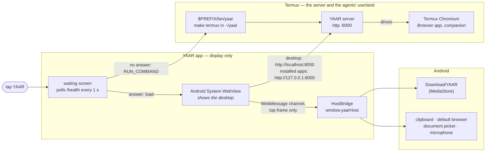

# YAAR on Android

**Source:** `hosts/android/` (`MainActivity.java`, `HostBridge.java`, `Termux.java`), `packages/server/src/desktop-window/host-bridge.ts`, `scripts/codegen/android-host-script.ts`, `scripts/dev/start-termux.sh`, `scripts/dev/termux-open-desktop.sh`

This page is about what YAAR *is* on an Android phone: which two apps it is made of, what
happens when you tap it, and what its window does that a browser tab doesn't. Installing the
server in Termux is the [Termux guide](../guides/termux.md). The work still to do on Android is in
the [WebView host proposal](../proposals/webview_host_proposal.md#4-android-what-is-left).

> **Status (2026-09-29).** The host APK is built from source and verified against a server on
> a PC, on an API 35 emulator and on a Galaxy S25 (Android 16, WebView 153). It is not in the
> releases yet, and the cold start below has not run with a server in the phone's own Termux.

In short, YAAR on a phone is two apps. **Termux** runs the server, as it always has. The
**YAAR app** (`io.github.sorryhyun.yaar`) is only the display: one Android WebView showing
the desktop at `http://localhost:8000/`, with a `window.yaarHost` that saves files, reads the
clipboard and opens links the way a phone app does. Without the YAAR app, the desktop opens
in Chrome, as the Termux guide describes.



What each piece does:
- **Termux** holds the server and everything the agents run: bash, git, coreutils, curl.
  That is why the server is not in the APK. An APK that carried it would be rebuilding Termux.
- **The YAAR app** owns the window and nothing else. If it is closed, the server keeps
  running. If the server is not running, the app waits for it and can start it.
- **Android System WebView** is the renderer. It is Chromium, updated through the Play Store,
  not something YAAR ships.

---

## What gets installed

| Where | What it is | Written by |
|---|---|---|
| Termux: `~/yaar`, `$PREFIX/bin/yaar`, `~/.cache/yaar/` | The server checkout, its launcher, and the unpacked Claude Code | install.sh in Termux ([Termux guide](../guides/termux.md#install)) |
| The YAAR app, `io.github.sorryhyun.yaar` | The display: one activity, about 7 MB as a debug build | `adb install` for now (see [Building the app](#building-the-app)) |
| `/data/data/io.github.sorryhyun.yaar/` | The WebView's own storage (localStorage, IndexedDB, service worker, HTTP cache), private to the app | the WebView |
| `Download/YAAR/` | What you save from the desktop | the YAAR app and DownloadManager |

The app's only dependencies are `androidx.webkit` and `androidx.core`. It has no Play
services, so it can go to F-Droid.

---

## What happens when you open it

```
tap YAAR
  └ waiting screen, GET http://localhost:8000/health every second (800 ms timeout)
       ├ answer    → load http://localhost:8000/, shown at the first paint
       └ no answer → Termux installed?  no  → say so, with the install command, and keep polling
                                         yes → takes RUN_COMMAND?  no  → "run yaar in Termux", Open Termux button, keep polling
                                                                   yes → granted?  no  → ask for it, and keep polling
                                                                                   yes → run $PREFIX/bin/yaar once, keep polling
```

1. **The app shows a waiting screen and polls `/health`.** Any HTTP answer counts, so a server
   that is still starting its agents is already enough.
2. **No server: it starts one in Termux.** It sends Termux a `RUN_COMMAND` to run `yaar` in a
   new terminal session without bringing Termux to the front. That is the same launcher you
   would type. It is sent once per wait, and the app keeps polling whatever Termux does with it.
3. **The server answers, and the desktop loads.** The WebView stays hidden until the page has
   painted, so you go from the waiting screen straight to the desktop.

The port is 8000, unless the app was opened by a `VIEW` of another `http://localhost:<port>/`,
which is the URL `termux-open-desktop.sh` passes.

This cold start has not run on a phone yet: the emulator has no Termux, and the phone it was
checked on has the Google Play Termux (below).

### Termux from Google Play: run `yaar` yourself

The Google Play build of Termux (checked: `googleplay.2026.06.21`) has no `RunCommandService`,
so there is no `RUN_COMMAND` for the app to ask for. Android refuses a permission no app
declares without showing anything. The app checks for the service first, and with this Termux
its waiting screen says to run `yaar` in Termux, with an **Open Termux** button. `yaar` then
opens the desktop back in the YAAR app ([Fallbacks](#fallbacks)), and the app, which kept
polling, is already on it.

Everything else is the same with either Termux. Only the start is by hand.

### The two one-time grants

With the F-Droid or GitHub Termux, `RUN_COMMAND` needs two things, and the waiting screen
names whichever is missing:

- **The permission.** Android asks "Allow YAAR to run commands in Termux?" the first time the
  app finds no server.
- **Termux's consent.** Termux refuses outside apps unless you add this, with its own
  notification rather than an error the app can see:

  ```bash
  echo 'allow-external-apps = true' >> ~/.termux/termux.properties
  termux-reload-settings
  ```

Without either, run `yaar` in Termux yourself. The app picks the server up within a second.

### The two origins

The desktop loads from `http://localhost:8000`. Installed apps' iframes load from
`http://127.0.0.1:8000`, a different origin on the same socket (see
[app-origin isolation](../guides/remote_mode.md#app-origin-isolation)). The app's network
security config allows cleartext to those two hosts only. Third-party cookies are on, because
to the WebView the two origins are different sites.

There is no h2 here, unlike the Mac's window. The traffic is plain HTTP/1.1, the same as in
Chrome on the phone.

---

## What the window does that a browser tab doesn't

The desktop is the same frontend Chrome would show. It learns that it is in YAAR's app from
`window.yaarHost`, which exists only in the desktop's top frame and never in an app iframe:

| Feature | In the YAAR app |
|---|---|
| Saving (window export, an app's `downloadBlob()`) | Written to `Download/YAAR/` through MediaStore, which needs no storage permission. A name already there becomes `name (1).ext`; nothing is overwritten. A toast says where it went |
| Links to files (`<a download>` on an http URL, attachments) | Handed to DownloadManager, with its usual notification, into `Download/YAAR/` |
| Clipboard read | Reads the Android clipboard directly. Android only lets the focused app do that, which Termux:API cannot do from the background on Android 10+ |
| Links and popups | Off-machine http(s) opens in your default browser. Google's sign-in has to, because it refuses embedded WebViews. Blank, loopback and `blob:` popups open full-screen over the desktop, and Back closes them |
| Microphone | Allowed for `localhost` and `127.0.0.1` only. The first time, Android asks; after that, Settings → Apps → YAAR → Permissions decides |
| File upload | The system document picker, with multi-select |
| Back | Puts one layer of the desktop away, as in Chrome. With nothing left, YAAR goes to the background instead of closing |
| Screen edges and keyboard | The desktop is laid out between the status bar and the navigation bar, and the keyboard pushes it up |
| A renderer crash | The WebView is recreated and the desktop reloads. The app does not die with it |

The Browser app, and anything else that drives a browser for an agent, still uses Termux
Chromium. The YAAR app is only for you.

### How `window.yaarHost` gets into the page

- The page half is the Mac window's adapter, generated for Android
  (`scripts/codegen/android-host-script.ts` → `assets/yaar-host.js`). A server test fails if
  the checked-in copy drifts from its generator.
- The app injects it with androidx.webkit's `addDocumentStartJavaScript`, and the channel it
  talks over with `addWebMessageListener`. Both are scoped to the desktop's origin, so the
  `127.0.0.1` frames never get either.
- Bundled apps are same-origin with the desktop, so their frames do get the channel object.
  The Java side drops every message that is not from the main frame. The adapter itself
  defines nothing outside the top frame.
- It never uses `addJavascriptInterface`, which every frame would see.

A WebView too old for those two androidx.webkit features gets no host, and the app says so
in a toast. The desktop then saves and copies the way Chrome does.

### Why the bars are padded natively

The app draws edge to edge, which Android 15 enforces on an app that targets it. It pads the
WebView by the status bar, the navigation bar and the display cutout itself, and by the
keyboard when that is taller.
The page's `env(safe-area-inset-*)` could not be trusted with them: WebView 124 on the
emulator reported the cutout there (51 px at the top) and never the navigation bar, so the
gesture bar sat on the shell's input.

WebView 153 on the Galaxy S25 does report the bars (35 px at the top, 48 px at the bottom),
on top of the native padding. The shell's `env()` rules then pad a second time: an empty band
above a maximized window, and below the command sheet's handle. Fixing it is open in the
[proposal](../proposals/webview_host_proposal.md#4-android-what-is-left).

---

## How it ends

The YAAR app and the server have separate lives:

- **Back with nothing to put away, or Home,** sends the app to the background. The WebView is
  paused (`onPause`), the desktop reports itself hidden, and the server keeps running.
- **Swiping YAAR away from Recents** closes the display only. The server keeps running in
  Termux, held awake by its wake lock.
- **Stopping the server** is done in Termux: `Ctrl-C` in its session, or closing the session
  ([Termux guide](../guides/termux.md#day-to-day)).
- **A server that goes away under an open desktop** is handled by the desktop's own reconnect,
  as in Chrome. A reload does not bring the waiting screen back: once the service worker has
  cached the shell, it answers the reload itself, so the WebView never sees the error. The
  desktop reconnects when the server returns.

---

## Fallbacks

- **Opened from Termux.** `termux-open-desktop.sh`, which `yaar` and notification taps run,
  opens the YAAR app first, pinned to its package. Without it, the installed Chrome app (a
  WebAPK) if there is one, then Chrome, then the default browser. See the
  [Termux guide](../guides/termux.md#first-run).
- **An old WebView.** There is no host, so everything works the way it does in Chrome.

---

## Building the app

There is no release build yet. Build it on a desktop, not in Termux, with JDK 17 or later.
JDK 21 is what it was built with; the JDK Homebrew's `gradle` pulls in is newer, so point
`JAVA_HOME` at 21.

```bash
brew install --cask android-commandlinetools
export ANDROID_HOME=/opt/homebrew/share/android-commandlinetools
export JAVA_HOME=$(/usr/libexec/java_home -v 21)
sdkmanager "platform-tools" "platforms;android-37.0" "build-tools;36.0.0"

cd hosts/android
./gradlew assembleDebug
adb install -r app/build/outputs/apk/debug/app-debug.apk
```

- `compileSdk` is 37 because `androidx.core` 1.19 requires it; the app runs on Android 10
  (API 29) and later.
- A debug build is signed with your machine's debug key. The release build will use one
  keystore from its first public release onward, and moving between the two takes an
  uninstall, because Android refuses an update signed by another key.
- After changing `desktop-window/host-bridge.ts`, regenerate the page half with
  `bun scripts/codegen/android-host-script.ts`.

### Running it against a PC

The emulator (or a phone over adb) can reach a server on your computer. `adb reverse` makes
the device's `localhost:8000` the computer's, for both origins:

```bash
MCP_SKIP_AUTH=1 LAUNCH_CHROME=0 ./scripts/dev/start.sh claude   # the server, on the PC
adb reverse tcp:8000 tcp:8000
adb shell am start -n io.github.sorryhyun.yaar/.MainActivity
```

A debug build turns WebView debugging on, so the desktop can be driven over CDP from the PC:

```bash
adb forward tcp:9333 localabstract:webview_devtools_remote_$(adb shell pidof io.github.sorryhyun.yaar)
curl -s localhost:9333/json      # or chrome://inspect
```

An open popup is a target of its own, also on `localhost:8000`, so pick the desktop by its
exact URL, `http://localhost:8000/`.

The emulator's WebView is the system image's, 124 on API 35, and it cannot update. Checks
that depend on the WebView version, like WebGPU and the safe-area insets, need a phone.

---

## Uninstalling

```bash
adb uninstall io.github.sorryhyun.yaar     # or Settings → Apps → YAAR → Uninstall
```

`Download/YAAR/` is left alone. Removing the server is the
[Termux guide's](../guides/termux.md) business.

---

## Troubleshooting

| Symptom | Cause |
|---|---|
| "YAAR's server runs in Termux, which is not installed" | Install Termux, then YAAR in it ([Termux guide](../guides/termux.md#install)) |
| "Starting YAAR in Termux…" and nothing happens | Termux refused the command: add `allow-external-apps = true` (above). Otherwise open Termux, whose new session shows what `yaar` is doing |
| A toast says the WebView is too old for the host bridge | Update Android System WebView from the Play Store |
| An app's Save or Export does nothing, or "Couldn't save this download (blob:)" | The app was compiled before its SDK learned about hosts, so it tries a `blob:` link the WebView cannot save. Recompile the app |
| "Open Termux and run `yaar`" | This Termux is the Google Play build, which cannot start the server for another app. Run `yaar` in it ([above](#termux-from-google-play-run-yaar-yourself)) |
| `yaar` opens Chrome, not the YAAR app | The checkout predates the launcher preferring the app: `git pull` in `~/yaar` |
