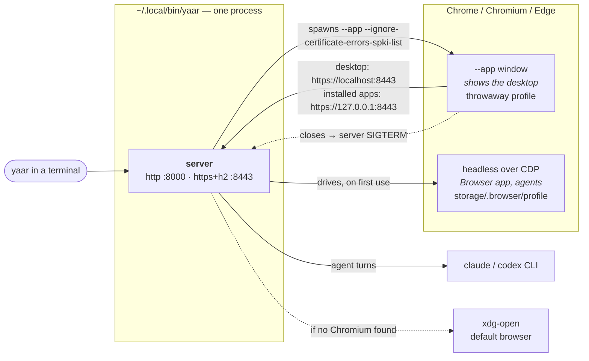

# YAAR on Linux

**Source:** `install.sh`, `packages/server/src/config/env.ts`, `packages/server/src/exe-entry.ts`, `packages/server/src/desktop-window/library.ts`, `packages/server/src/lib/browser/webgpu-flags.ts`, `packages/server/src/lib/browser/chrome.ts`, `packages/server/src/lib/browser/pool.ts`, `packages/server/src/http/local-tls.ts`, `packages/server/src/features/update/installer.ts`, `scripts/dev/start.sh`, `scripts/dev/setup-webgpu-linux.sh`

This page is about what YAAR *is* once it is installed on a Linux desktop: which files it puts
where, the processes that run when you start it, and how they end. To install it, see the
[README](../../README.md#install). Termux on Android is Linux too, but it has its own page:
[android.md](./android.md).

In short, YAAR on Linux is one binary, `~/.local/bin/yaar`. It keeps everything you make in
the same directory as the binary. It shows the desktop in Chrome (or Chromium, or Edge) in
`--app` mode, not in a window of its own. The
[WebView host proposal](../proposals/webview_host_proposal.md#3-linux-no-go-stays-on-chrome---app)
records why Linux has no WebView window.



What each piece does:
- **YAAR** is the server. It draws no UI itself and has no native window code on Linux.
- **Chrome** does two jobs. A visible `--app` window shows you the desktop, and a separate
  headless Chrome is the browser the server drives for agents. They are two processes with two
  profiles, and neither knows about the other.

---

## What gets installed

| Path | What it is | Written by |
|---|---|---|
| `~/.local/bin/yaar` | The binary | install.sh, the in-app updater |
| `~/.local/bin/apps/` | The bundled apps | install.sh, the in-app updater |
| `~/.local/bin/{config,storage,session_logs,user-apps}/`, `~/.local/bin/.env` | Everything YAAR writes | YAAR itself |
| `~/.local/bin/config/local-tls/` | The local TLS socket's self-signed key and certificate | YAAR itself |
| `~/.local/bin/storage/.browser/profile/` | The headless Chrome's profile, kept across launches | Chrome |
| `/tmp/yaar-chrome-<ms>/` | The `--app` window's profile, a new one per launch | Chrome |

`INSTALL_DIR` moves everything in the `~/.local/bin` rows. It changes where install.sh puts
the binary, and a bundled binary uses its own directory as its data root (`PROJECT_ROOT` in
`config/env.ts`). macOS used this same bare layout until 0.22.0, when it moved to an `.app`
(see [mac.md](./mac.md#moving-from-a-bare-install)). Linux has no reason to move, so it keeps
the layout.

Nothing is registered with the desktop: no `.desktop` entry, no icon, no autostart. `yaar`
is started from a terminal.

---

## What happens when you run it

```
yaar
  ├ listen  http://127.0.0.1:8000                    ← MCP, agents, anything plain
  ├ listen  https://127.0.0.1:8443 (h2)              ← what the window uses
  ├ YAAR's own window? no library for linux → skip
  └ spawn  <chromium> --app=https://localhost:8443/ --user-data-dir=/tmp/yaar-chrome-<ms> …
```

1. **The server starts.** It listens on `PORT` (default 8000) and on a local TLS socket that
   prefers `PORT + 443` (so 8443). Either port moves up to the next free one when taken.
2. **The server tries YAAR's own window and skips it.** `library.ts` has no WebView library
   for Linux, so `openDesktopWindow` returns false at once, with nothing spawned and no wait.
3. **The server finds a Chromium on `PATH`**, trying `google-chrome`, `google-chrome-stable`,
   `chromium`, `chromium-browser` and `microsoft-edge` in that order. The first one found
   opens the desktop in `--app` mode, with:
   - `--ignore-certificate-errors-spki-list=<pin>` (plus `--test-type` to hide Chrome's
     warning about that flag), so it trusts the local TLS socket's one key and gets h2;
   - a fresh `--user-data-dir` under `/tmp`, so it never hands the window to a Chrome you
     already have open (see [How it ends](#how-it-ends));
   - the Linux WebGPU flags (next section).

The headless Chrome is not started here. It starts the first time an agent or the Browser
app needs a browser, and it is found through a different list: `CHROME_PATH`, then fixed
paths under `/usr/bin` and `/snap/bin`, then the same names on `PATH`.

### WebGPU

Linux Chrome ships with WebGPU off, because the Vulkan backend it needs is soft-blocklisted
there. Without it, apps that run models get "Failed to get GPU adapter" and fall back to
single-thread wasm. So both of YAAR's Chrome launches turn it on:

- **`--enable-features=Vulkan`** enables the real GPU adapter.
- **`--enable-dawn-features=vulkan_enable_f16_on_nvidia`** lifts Dawn's hold on `shader-f16`
  for NVIDIA. Without it, fp16 models don't run on NVIDIA under Linux, though they do on
  Windows and macOS. On other GPUs it does nothing.

The headless Chrome adds `--use-angle=vulkan --disable-vulkan-surface`, which are safe only
without a window. `webgpu-flags.ts` explains each flag.

### The two origins

As on every platform, the desktop is `https://localhost:8443` and installed apps' iframes
load from `https://127.0.0.1:8443`. That is a different origin on the same socket (see
[app-origin isolation](../guides/remote_mode.md#app-origin-isolation)). Chromium trusts both
through the SPKI flag, so no pin needs checking outside the browser, unlike macOS.

---

## What the window is, and isn't

The window is plain Chrome, and it has none of the extras
[macOS's own window](./mac.md#what-the-window-does-that-a-browser-tab-doesnt) adds. The desktop
finds no `window.yaarHost`, so everything takes the browser's path:

| Feature | In the `--app` window |
|---|---|
| Downloads | Chrome's own downloads, to its default folder (`~/Downloads`) |
| Clipboard read | Chrome's permission prompt |
| Links and popups | Chrome's: a popup opens as another Chrome window |
| Microphone | Chrome's permission prompt, for `localhost` and `127.0.0.1` |
| DevTools | Ctrl+Shift+I, as in any Chrome window |

**The window's browser storage starts empty on every launch**, because each launch gets a new
profile. That covers the desktop's and every app iframe's localStorage, IndexedDB, Cache API,
and any permission you granted. Nothing an app should keep lives there anyway: app state
belongs in app storage on the server's disk, which is also where every ML app keeps its
weights. The old profiles are never removed. They stay in `/tmp` until something else clears
it (a reboot, where `/tmp` is a tmpfs).

The release window has **no DevTools port**, so neither headless driving nor the clipboard
pre-grant can attach to it. Both of those need the [source checkout](#running-from-source).

---

## How it ends

- **Closing the window stops the server**, provided the window was open for at least 3 s.
  The server then sends itself SIGTERM and runs the same shutdown as Ctrl-C: headless Chrome,
  warm provider processes and the session log flush. A Chrome that exits sooner is taken to
  have handed the window to another Chrome instance and quit, and in that case the server
  keeps running. The fresh profile per launch is there to make that case rare.
- **A server that dies leaves the window open.** Nothing ties Chrome to the server's pid, so
  after a crash or `kill` the window stays open onto a dead socket. Close it yourself.
- **Ctrl-C in the terminal** stops the server and the headless Chrome. The `--app` Chrome
  is spawned in the terminal's process group, so the same Ctrl-C reaches it too.

Starting `yaar` again while it runs starts a second server on the next free port, with a
second window, over the same data directory. Usually you want to switch to the open window
instead.

---

## Fallbacks

1. **Chrome, Chromium or Edge in `--app` mode**, as above.
2. **Your default browser**, through `xdg-open http://127.0.0.1:8000`. The server redirects
   the desktop to `localhost`. The default browser can't trust the TLS pin, so there is no
   h2 here, and a browser other than Chromium may lack WebGPU. Closing that tab does not stop
   the server; use Ctrl-C.

Without a display, as over SSH or on a server, neither of these shows anything. The server
still runs, and you reach it from another machine through
[remote mode](../guides/remote_mode.md).

---

## Running from source

`make claude-dev` and the other `make` targets run the same server, but open the desktop
differently (`scripts/dev/start.sh`, `LAUNCH_CHROME=1`):

| | Release binary | Source checkout |
|---|---|---|
| Data root | `~/.local/bin/` | the checkout |
| Window profile | `/tmp/yaar-chrome-<ms>/`, new per launch | `~/.yaar-chrome/`, kept (`YAAR_CHROME_PROFILE` moves it; `MOBILE=1` uses `~/.yaar-chrome-mobile`) |
| DevTools port on the window | none | `CHROME_DEBUG_PORT`, default 9222 |
| Clipboard read | Chrome's prompt | pre-granted over that port (`clipboard-grant.ts`) |
| WebGPU | the flags above | the same flags, kept in sync by hand in `start.sh` |

Because the source window keeps its profile and has a DevTools port, it is the one that
[headless driving](../guides/headless_driving.md) attaches to. `make install` also runs
`scripts/dev/setup-webgpu-linux.sh`, which turns WebGPU on in your everyday Chrome profiles
(`~/.config/google-chrome`, `~/.config/chromium`, the snap Chromium, `~/.yaar-chrome`) by
editing each one's `Local State`. It skips any profile whose Chrome is running, and
`make webgpu` runs it again.

---

## Updating

There are two ways to update:

- **Run install.sh again.** It replaces the binary and unpacks the new apps over
  `~/.local/bin/apps/`, leaving your data alone. Unlike on macOS, it does not check whether
  `yaar` is running. Linux lets a running binary be replaced, so the old server keeps going
  until you restart it.
- **The in-app updater.** It downloads and verifies the release binary and apps archive into
  `~/.local/bin/.yaar-update/`, which is on the same filesystem, so every swap is a rename.
  It swaps `apps/` first, keeping `apps.previous` until the swap succeeds, then the binary,
  leaving the old one as `yaar.previous` beside it. Restart YAAR to run the new version.

---

## Uninstalling

```bash
rm -rf ~/.local/bin/yaar ~/.local/bin/yaar.previous ~/.local/bin/apps ~/.local/bin/.yaar-update
rm -rf /tmp/yaar-chrome-*
# and, if you mean it — everything you made in YAAR:
rm -rf ~/.local/bin/{config,storage,session_logs,user-apps,workspaces,.env}
```

---

## Troubleshooting

| Symptom | Cause |
|---|---|
| The desktop opened in a normal browser tab | No Chromium on `PATH` under the names above. Install Chrome or Chromium, or accept the tab (no h2) |
| Closing the window didn't stop YAAR | It closed within 3 s of opening, or it is a default-browser tab. Ctrl-C the terminal |
| "Failed to get GPU adapter" in an ML app | The window didn't get the WebGPU flags: it is a default-browser tab, or a Chrome you opened yourself on the URL. Use the window `yaar` opens, or run `make webgpu` for your own profiles |
| The Browser app says Chrome/Chromium not found | The headless Chrome is looked up separately. Set `CHROME_PATH` to the binary |
| An app lost its settings after a restart | It kept them in browser storage, which the release window starts without every launch. The app should use app storage |
