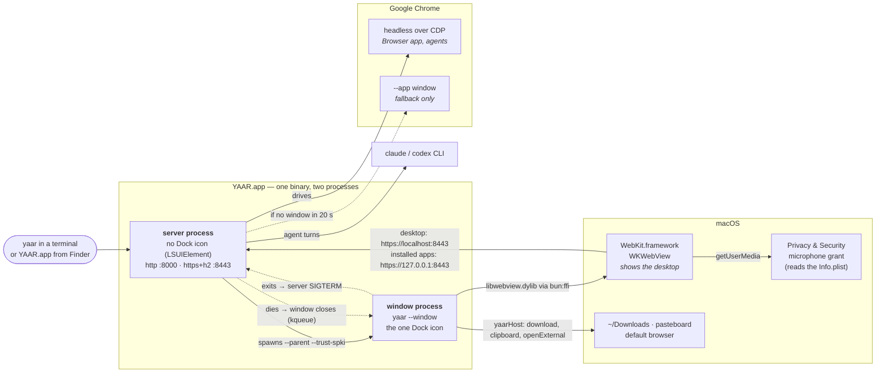

# YAAR on macOS

**Source:** `install.sh`, `scripts/build/exe-bundle.js`, `packages/server/src/config/env.ts`, `packages/server/src/macos-bundle.ts`, `packages/server/src/exe-entry.ts`, `packages/server/src/desktop-window/launch.ts`, `packages/server/src/desktop-window/host.ts`, `packages/server/src/desktop-window/host-bridge.ts`, `packages/server/src/desktop-window/library.ts`, `packages/lib/src/webview/native/webview_extras.mm`, `packages/server/src/http/local-tls.ts`, `packages/server/src/features/update/installer.ts`

This page is about what YAAR *is* once it is installed on a Mac: which files it puts where, the
processes that run when you start it, and how they end. To install it, see the
[README](../../README.md#install). For the platforms still to come (Windows, Linux) and the
checks a new host runs, see the [WebView host proposal](../proposals/webview_host_proposal.md).
Android is [android.md](./android.md).

In short, YAAR on a Mac is `~/Applications/YAAR.app`. It is one binary that runs twice: once
as a server with no window, and once as a native window showing the desktop in WebKit. It
keeps everything you make in `~/Library/Application Support/YAAR`.



What each piece does:
- **YAAR** owns both processes and never draws a pixel of UI itself.
- **WebKit** is the renderer. It is the system framework, not something YAAR ships.
- **macOS** decides the microphone, and it reads the bundle's Info.plist to do so.
- **Chrome** is never what you look at, except as a fallback. It is the browser the server
  drives for agents.

---

## What gets installed

| Path | What it is | Written by |
|---|---|---|
| `~/Applications/YAAR.app` | The app: the `yaar` binary, bundled apps, icon, Info.plist, ad-hoc signature | install.sh, the in-app updater |
| `~/.local/bin/yaar` | A two-line launcher: `exec ~/Applications/YAAR.app/Contents/MacOS/yaar "$@"` | install.sh |
| `~/Library/Application Support/YAAR/` | Everything YAAR writes: `config/`, `storage/`, `session_logs/`, `user-apps/`, `apps/`, `.env` | YAAR itself |
| `~/Library/Caches/YAAR/libwebview-<hash>.dylib` | The native WebView library, taken out of the binary | the window process |
| `~/Library/WebKit/io.github.sorryhyun.yaar/`, `~/Library/Caches/io.github.sorryhyun.yaar/` | The window's browser storage (localStorage, IndexedDB, service worker, HTTP cache) | WebKit |

`APP_DIR` and `INSTALL_DIR` move the first two rows. The rest are fixed.

The binary is built on Linux, like every other release binary. **install.sh builds the `.app`
around it on your Mac**, using `codesign`, `sips` and `iconutil`, which every macOS has and the
Linux release runner does not. The Info.plist it writes is the same one
`scripts/build/exe-bundle.js` writes for a local `dist/YAAR.app`, and
`macos-bundle-plist.test.ts` fails if the two ever differ.

### Why it is an `.app` and not a bare binary

The window can only record audio from inside a bundle. WKWebView hides
`navigator.mediaDevices` from every frame of a process whose main bundle has no
`NSMicrophoneUsageDescription`. It is not a permission it refuses; the API simply does not
exist in the page, and `isSecureContext` is still true. A bare binary has no Info.plist, so
transcribe and any other recording app fail before macOS is ever asked. This was measured on
0.22.0, whose installer still shipped a bare binary.

The bundle also gives macOS something to file the permission under. The microphone grant is
recorded against the bundle id `io.github.sorryhyun.yaar` and its signature, and the prompt
names YAAR rather than your terminal.

Because the grant depends on that signature, nothing inside the bundle is ever written at run
time. That is why the data lives in Application Support. The bundled apps are the one
exception, and they are handled by copying (next section).

---

## What happens when you run it

```
yaar (launcher)
  └ exec YAAR.app/Contents/MacOS/yaar                ← server process, no Dock icon (LSUIElement)
       ├ copy Resources/apps → Application Support/YAAR/apps   (only when the build changed)
       ├ listen  http://127.0.0.1:8000                ← MCP, agents, anything plain
       ├ listen  https://127.0.0.1:8443 (h2)          ← what the window uses
       └ spawn  yaar --window https://localhost:8443/ --parent <server pid> --trust-spki <pin>
            └ window process: extract the dylib, open a WKWebView, show the Dock icon
                 └ prints "yaar-window-opened" → the server knows the window is up
```

1. **The launcher execs the bundle's executable.** It must run from its own path inside
   `YAAR.app` for macOS to find the bundle, and so the Info.plist. A symlink would not. Opening
   `YAAR.app` from Finder or Spotlight skips the launcher and does the same thing.
2. **The server copies the bundled apps out.** The app ships its apps read-only in
   `Contents/Resources/apps` with a `.bundle-stamp`. When that stamp differs from the one in
   `Application Support/YAAR/apps`, meaning this is a new build, they are copied over. That is
   the same overwrite a bare install gets when install.sh unpacks a new apps archive. An
   unchanged build copies nothing.
3. **The server starts**, with `PROJECT_ROOT` set to `~/Library/Application Support/YAAR`
   because it runs from inside a `.app` (`MACOS_APP_BUNDLE` in `config/env.ts`). It listens
   on `PORT` (default 8000) and on a local TLS socket that prefers `PORT + 443` (so 8443).
   Either moves up to the next free port when taken.
4. **The server spawns itself again as the window.** The window must be its own process:
   `webview_run()` never gives back the thread it runs on, and AppKit refuses to run anywhere
   but a process's main thread. The window process never loads the server. It only:
   - extracts the WebView library to `~/Library/Caches/YAAR/`, under a name hashed from its
     bytes, so a new build never loads an old library;
   - opens the window;
   - makes itself a regular app, so there is exactly one Dock icon, the window's.
5. **The server waits up to 20 s** for the window's "opened" line. If the line never comes, it
   falls back (see [Fallbacks](#fallbacks)).

Nothing is started at login, and nothing keeps running after you quit.

### The two origins

The window loads the desktop from `https://localhost:8443`. Installed apps' iframes load from
`https://127.0.0.1:8443`, a different origin on the same socket (see
[app-origin isolation](../guides/remote_mode.md#app-origin-isolation)). Both use the local TLS
socket's self-signed certificate.

WebKit has no command-line switch for trusting such a certificate, unlike Chromium's SPKI
flag. So the server passes the key's pin to the window process (`--trust-spki`), and the
window's navigation delegate accepts that one key, on those two loopback hosts, and nothing
else.

The TLS socket is there for HTTP/2. Over HTTP/1.1, WebKit opens only six connections per
host, and a few long verb calls would queue everything behind them.

---

## What the window does that a browser tab doesn't

The desktop is the same frontend Chrome would show. It learns that it is in YAAR's window
from `window.yaarHost`, which exists only in the desktop's top frame and never in an app
iframe:

| Feature | In the window |
|---|---|
| Downloads (window export, an app's `downloadBlob()`, `<a download>`, attachments) | Saved to `~/Downloads`, never overwriting a file; the Dock's Downloads stack bounces |
| Clipboard read | Reads the macOS pasteboard directly, with no web permission prompt |
| Links and popups | Off-machine http(s) opens in your default browser; blank, loopback and `blob:` popups (OAuth) open in a bare popup window |
| Microphone | Allowed for `localhost` and `127.0.0.1` only. The first time, macOS asks; after that, System Settings → Privacy & Security → Microphone decides |
| ⌘W | Closes the top YAAR window on the desktop, the same as Ctrl+W, not the native window |
| ⌘Q, the red close button | Quit YAAR |

macOS remembers the window's size and position between launches.

`YAAR_WEBVIEW_DEVTOOLS=1` adds Safari's Web Inspector (right-click → Inspect Element).

The Browser app, and anything else that drives a browser for an agent, still uses Chrome on
the server side. The window is only for you.

Apps that run models run them on this window's WebGPU, which is WebKit's: no `subgroups`, and
about 1.8× slower than Chrome on the same Mac for anima. Measurements and options:
[mac_ml.md](./mac_ml.md).

### WebKit, not Chrome

Three engine differences were measured on 2026-09-29 (macOS 26.6), with a page on `localhost`
and an iframe on `127.0.0.1`:

- **No WebP encoding.** `canvas.toDataURL('image/webp')` returns PNG. The server reads the
  type off the bytes and re-encodes captures (`captureForModel` in `@yaar/lib/image`), and
  `uploadImage.ts` keeps the original file when the canvas did not produce WebP.
- **Installed apps' browser storage does not survive a launch.** The `127.0.0.1` frame's
  localStorage and IndexedDB are empty every time, though its Cache API and the desktop's own
  storage persist, and its quota is a tenth of the desktop's. No app loses weights to this,
  because every ML app keeps them on server disk. App state belongs in app storage anyway.
  Why WebKit does it is unexplained.
- **No Page Lifecycle `freeze` event.** Presence falls back to `visibilitychange`, which is
  enough on a desktop.

---

## How it ends

The window and the server end together, whichever goes first:

- **Closing the window (or ⌘Q) stops the server.** When the window process exits, the server
  sends itself SIGTERM and runs the same shutdown as Ctrl-C: headless Chrome, warm provider
  processes and the session log flush.
- **A server that dies closes the window.** The window watches the server's pid (`--parent`,
  a kqueue source), so even a SIGKILLed server takes its window with it, within about
  1.5 s. You are never left with a window onto nothing.

Each server has exactly one window, and a window is never shared. Starting `yaar` again while
it runs starts a second server on the next free port, with a second window, over the same
data directory. Usually you want to switch to the open window instead.

---

## Fallbacks

If the window cannot appear, YAAR still runs, just in a browser:

1. **YAAR's window.** This is skipped when `YAAR_WEBVIEW=0`, when the binary carries no WebView
   library, or when no window reports in within 20 s.
2. **Chrome or Edge in `--app` mode.** It uses a throwaway profile per launch and trusts the
   same TLS pin through Chromium's SPKI flag, so it still gets h2.
3. **Your default browser**, over plain `http://localhost:8000`. The default browser can't
   trust the pin, so there is no h2 here.

The fallbacks have none of the window's extras: downloads, clipboard and popups work the way
the browser does them.

---

## Updating

There are two ways to update, and they end up in the same place:

- **Run install.sh again.** It builds a new `YAAR.app` beside the old one, swaps it in, and
  deletes the old one. The launcher and your data are left alone. It refuses while `yaar` is
  running.
- **The in-app updater.** It downloads and verifies the release binary and apps archive, puts
  the apps in `Contents/Resources/apps` with a new stamp, and replaces the binary. It keeps its
  staging area and the old binary outside the bundle, and then **re-signs the bundle**, so the
  microphone grant still matches. Restart YAAR to run the new version.

Either way, the next launch sees a new stamp and copies the new bundled apps into
Application Support. The browser storage in `~/Library/WebKit/…` survives the update.

### Moving from a bare install

Releases up to 0.22.0 installed a bare binary at `~/.local/bin/yaar`, with its data beside it.
The first install of the `.app` recognizes that file: it is a binary, not a `#!` launcher. The
install then moves the data over:

- `config`, `storage`, `session_logs`, `user-apps`, `workspaces` and `.env` are moved from
  `~/.local/bin/` into `~/Library/Application Support/YAAR/`. A move within one volume is
  instant, whatever the size of `storage/`.
- Anything already at a destination is set aside under
  `Application Support/YAAR/.pre-migration-<time>/`. It is never deleted or merged.
- The old `apps/` copy and any updater backup in `~/.local/bin/` are removed. Both were the
  installer's own files.

This happens once. Later installs find the launcher and move nothing.

---

## Starting from a terminal vs. from Finder

Both start the same process, but not with the same environment:

- **`yaar` in a terminal** inherits your shell's `PATH` and environment. This is the
  dependable way to start it.
- **YAAR.app from Finder, the Dock or Spotlight** gets the minimal `PATH` macOS gives GUI
  apps (`/usr/bin:/bin:/usr/sbin:/sbin`).
  - Claude Code is still found: YAAR checks `~/.local/bin/claude` itself.
  - **Codex is looked up on `PATH` only**, so a `codex` in `~/.local/bin` or Homebrew is not
    found, and the provider is not available.
  - Output goes nowhere visible. The session logs in Application Support are what remain.

Settings that must hold however YAAR is started go in
`~/Library/Application Support/YAAR/.env`, which the server loads at startup (the real
environment wins over it).

---

## Uninstalling

```bash
rm -rf ~/Applications/YAAR.app ~/.local/bin/yaar
rm -rf ~/Library/Caches/YAAR ~/Library/Caches/io.github.sorryhyun.yaar ~/Library/WebKit/io.github.sorryhyun.yaar
tccutil reset Microphone io.github.sorryhyun.yaar
# and, if you mean it — everything you made in YAAR:
rm -rf ~/Library/Application\ Support/YAAR
```

---

## Troubleshooting

| Symptom | Cause |
|---|---|
| "Recording needs a secure page" in transcribe, on `localhost` | The window runs from a bare binary, not the bundle. `head -c 2 ~/.local/bin/yaar` should print `#!`; if not, rerun install.sh |
| Recording refused after the first time | The microphone grant was declined. Turn YAAR on in System Settings → Privacy & Security → Microphone |
| Codex missing when started from the Dock | GUI apps get a minimal `PATH` (see above). Start `yaar` from a terminal |
| A Chrome window opened instead of YAAR's own | The window did not report in within 20 s, or `YAAR_WEBVIEW=0` is set. The server's stderr in the terminal says which |
| "YAAR is running" from install.sh | Close YAAR's window (which stops the server), then rerun |
