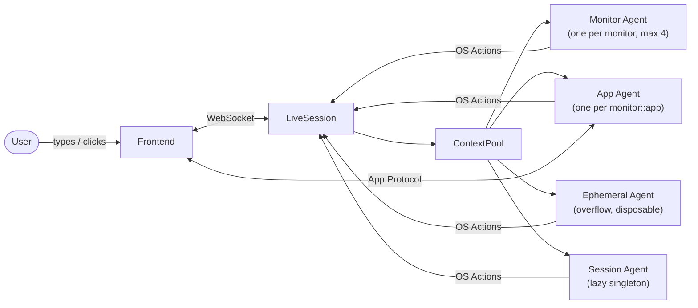
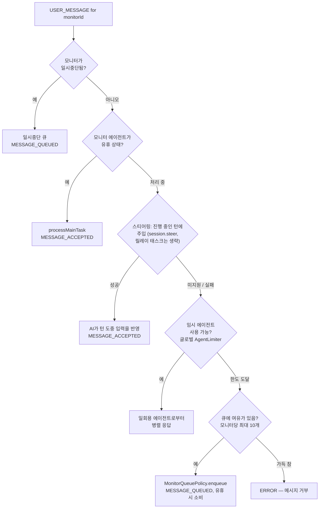
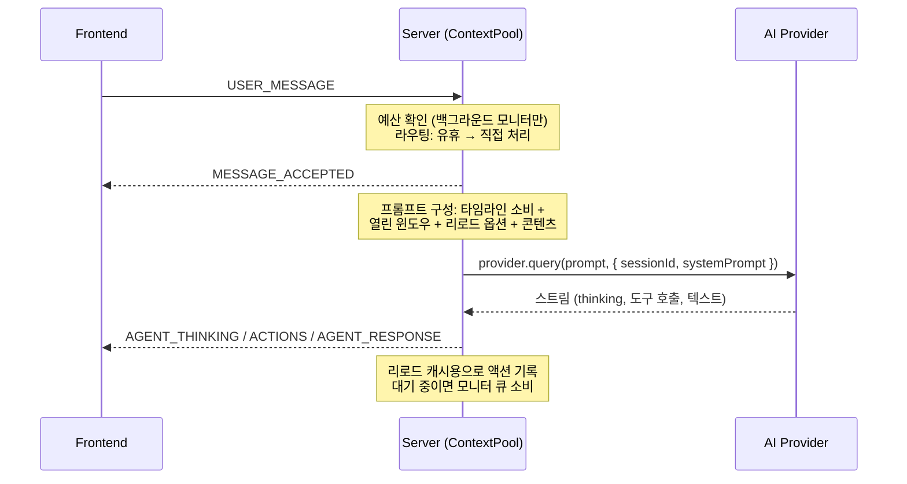
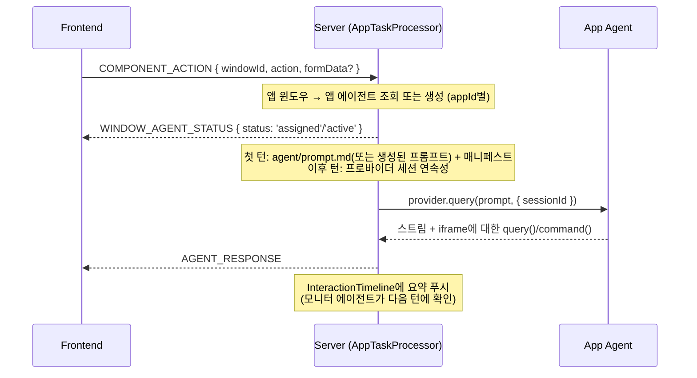
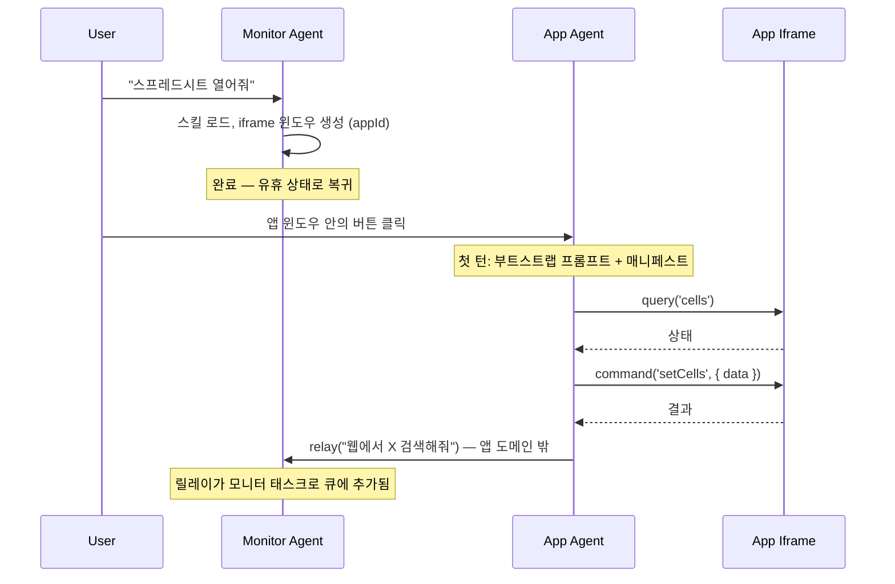
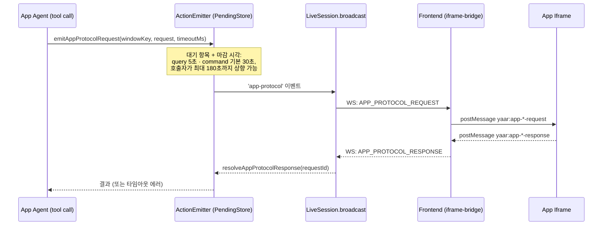
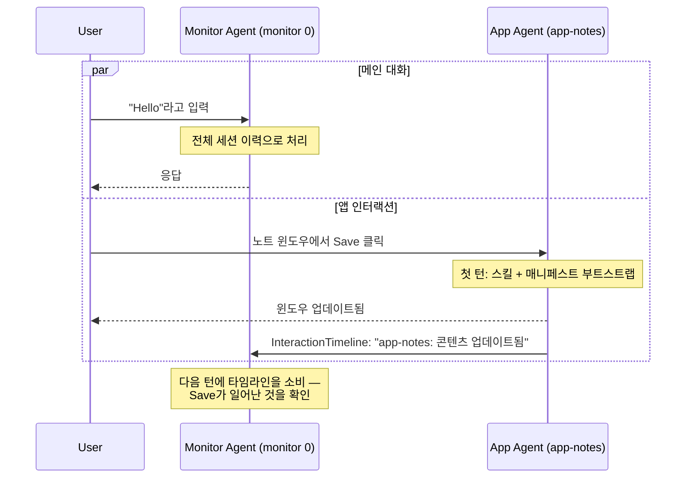

# 에이전트 아키텍처: 풀, 컨텍스트, 메시지 흐름

> [English version](../architecture/common_flow.md)

이 문서는 YAAR가 통합 풀링, 계층적 컨텍스트, 정책 기반 오케스트레이션을 통해 동시 다발적 AI 에이전트를 관리하는 방법을 설명합니다. 다이어그램은 Mermaid로 작성되었으며 — GitHub에서 네이티브로 렌더링됩니다.

## 전체 그림



다섯 가지 에이전트 티어가 세션의 `ContextPool` 내부에서 하나의 `AgentPool`을 공유합니다. 서버→프론트엔드로 나가는 모든 이벤트는 `LiveSession.broadcast()`를 거칩니다 (`BroadcastCenter`를 통한 모니터 단위 라우팅).

## 에이전트 유형

### 1. 모니터 에이전트 — 오케스트레이터

메인 대화 흐름을 처리하는 영속적인 제너럴리스트로, 모니터당 하나씩 존재합니다
(기본 모니터 `0`은 연결 시 미리 워밍되고, 나머지는 필요할 때 자동 생성, `MAX_MONITORS = 4`).

- **Role**: `main-{monitorId}-{messageId}` (메시지별로 설정); 정규 ID는 `main-{monitorId}`
- **세션**: 메시지 간에 동일한 프로바이더 세션을 재개 — 전체 대화 이력 유지
- **도구**: 윈도우, 알림, 스토리지 읽기/목록, 메모리, 스킬, 설정 훅,
  캐시 재사용, 그리고 위임(Claude의 Task 도구; 앱 메시징은
  `invoke('yaar://windows/{id}', { action: "message", ... })`를 통해, 필요하면
  `hook: "response"`로 앱 에이전트의 답변을 돌려받거나, `fresh: true`로 지금까지의 세션을
  전혀 기억하지 못하는 새 앱 에이전트가 답하게 함)
- **URI**: `yaar://agents/{instanceId}`

모니터 에이전트는 유저 의도를 파악하고 작업을 배분합니다: 사소한 일(알림, 윈도우 열기,
`reload_cached` 재사용)은 도구 호출 1~2번으로 직접 처리하고, 앱 도메인 작업은 앱 에이전트에게
넘기며, 무거운 리서치/빌드 작업은 프로바이더 서브에이전트에 위임합니다. 이렇게 자신의 턴을
짧게 유지함으로써 다음 메시지에도 즉시 응답할 수 있는 상태를 유지합니다.

### 2. 임시(Ephemeral) 에이전트 — 오버플로

모니터 에이전트가 처리 중이고 스티어링(steer)이 실패했을 때 생성됩니다. 새 프로바이더로
시작하며 **대화 이력이 없고**(열린 윈도우 + 리로드 옵션 + 태스크 내용만 수신), 태스크가
끝나면 즉시 폐기됩니다. 그 행동은 모니터 에이전트의 다음 턴을 위해 `InteractionTimeline`에
기록됩니다.

- **Role**: `ephemeral-{monitorId}-{messageId}`; 글로벌 `AgentLimiter`로 제한됨

### 3. 앱 에이전트 — 전문 오퍼레이터

앱 윈도우와의 첫 인터랙션 때 생성되어 `AppTaskProcessor`를 거쳐 라우팅되는, `appId`당 하나의
영속 에이전트입니다(같은 앱의 모든 윈도우가 이를 공유하며, 윈도우를 닫았다 다시 열어도 유지).

- **Role**: `app-{appId}-{messageId}`; 정규 ID는 `app-{appId}`
- **컨텍스트**: 첫 턴은 앱의 프롬프트로 부트스트랩되고(`agent/prompt.md`가 있으면 제너릭 프롬프트를
  대체하고, 없으면 제너릭 프롬프트를 그대로 씀) `protocol.json`
  매니페스트가 함께 주입됨; 이후 턴은 프로바이더 세션을 재사용 — 에이전트가 세션을 기억하는
  곳이 바로 이 프로바이더 세션이며, 그래서 길고 무관한 이력이 도움보다 방해가 될 때
  `{ action: "message", fresh: true }`(에이전트를 폐기하고 새 에이전트로 답하기)가
  처음부터 다시 시작하는 방법입니다
- **도구** (설계상 범위가 제한됨):

| 도구 | 용도 |
|------|------|
| `describe(appId?)` | 앱의 프로토콜 매니페스트 읽기 (자신의 윈도우, 또는 다른 앱의 윈도우) |
| `query(stateKey?, appId?)` | iframe 상태 읽기 — 키를 생략하면 매니페스트 반환 |
| `command(command, params?, appId?)` | iframe 액션 실행 |
| `relay(message)` | 앱 도메인 밖의 모든 것을 모니터 에이전트에 위임 |
| `direct_message` | `app.json`이 `"messaging": "all"`을 선언한 경우에만 |

`describe`/`query`/`command`에 다른 앱의 `appId`를 넘기는 것은 **크로스앱 제어**이며, 호출한
쪽의 `app.json` `controls` 목록으로 게이팅됩니다(번들 앱에 한함) — 예를 들어 devtools는
`"controls": ["browser-user"]`를 선언해 실제 브라우저를 직접 조작합니다.

### 4. 세션 에이전트 — 모니터 간 감독자

세션당 하나의 지연 생성(lazy) 싱글턴으로, `yaar://session/agents/session`을 통한 첫 호출 시
생성됩니다. 이 에이전트는 **`yaar://session/*`의 유일한 프린시펄**입니다
(`ResourceRegistry.execute()`에서 중앙 집중적으로 강제되며, 모니터/앱 에이전트가 접근하면
403을 받음) — 여기에는 유저의 실제 Chrome으로 통하는 유일한 문인 `yaar://session/browser`도
포함됩니다.

- **Role**: `session-{action}-{timestamp}`; 호출 간 프로바이더 세션 연속성 유지
- **도구**: Verb 도구만 사용(describe/read/list/invoke/delete) — WebSearch 없음, Task 없음
- **모니터 없음, 윈도우 없음** — 도구 결과와 릴레이 메시지로만 통신

> 풀 안에는 별도의 "태스크 에이전트" 티어가 없습니다. 위임된 리서치/코드 작업은 모니터
> 에이전트의 턴 안에서 프로바이더 내부 서브에이전트(Claude의 Task 도구)로 실행되며,
> `AgentPool`에는 전혀 나타나지 않습니다.

## 메시지 흐름

### 유저 메시지 → 모니터 에이전트

`MonitorTaskProcessor`는 다음 순서로 전략을 시도합니다:



직접 처리, 전체 흐름:



### 앱 윈도우와의 인터랙션 → 앱 에이전트

일반 윈도우에서 발생한 `COMPONENT_ACTION` / `WINDOW_MESSAGE`는 모니터 에이전트의 큐로 가고,
앱 윈도우에서 발생하면 `AppTaskProcessor`로 갑니다:



## 모니터 에이전트 ↔ 앱 에이전트: 역할 분담

모니터 에이전트는 유저와 대화를 아는 **제너럴리스트**이고, 앱 에이전트는 자신의 앱 내부
상태와 명령을 아는 **전문가**입니다.

| | 모니터 에이전트 | 앱 에이전트 |
|---|---|---|
| 아는 것 | 전체 대화, 자신의 모니터에 있는 모든 윈도우, 앱 카탈로그, 시스템 상태 | 앱 매니페스트(상태 키 + 명령), 앱 스킬, 자신의 인터랙션 이력 |
| 모르는 것 | 앱 내부 상태(셀, URL, 슬라이드), 앱 프로토콜 메커니즘 | 다른 윈도우, 더 넓은 대화, 웹/코드 도구 |
| 탈출구 | 앱 윈도우에 메시지 전송(`action: "message"`, 필요 시 `hook: "response"`, 필요 시 `fresh: true`) | `relay()`로 모니터 에이전트에 되돌리기 |



## 앱 프로토콜: 에이전트가 iframe과 대화하는 방법

앱은 iframe이 로드될 때 `@bundled/yaar`의 `defineApp({...})`을 통해 자기 서술적
계약(조회할 상태 키, 실행할 명령)을 등록합니다. 서버는 **윈도우 키별로** 준비 상태를
`WindowStateRegistry`에 저장하며, `query`/`command`는 등록될 때까지 최대 5초
(`requireAppReady`) 기다린 뒤 실패 처리됩니다.



윈도우는 **모니터 범위의 키**(`win.id`)로 주소를 지정하며, AI가 사용하는 원시 id는 절대
사용하지 않습니다: 같은 앱이 두 모니터에서 열려 있으면 원시 id를 공유하게 되는데, 프론트엔드는
*유저*가 보고 있는 모니터를 기준으로 원시 id를 해석합니다. 내장된 `__console` 상태 키는
주입된 프로토콜 스크립트가 응답하므로 앱이 등록되기 전에도 동작합니다.

## ContextTape: 계층적 메시지 이력

메시지는 계층적 추적을 위해 URI 형식의 출처 태그가 붙습니다:

```typescript
type ContextSource = `yaar://monitors/${string}` | `yaar://windows/${string}`;

interface ContextMessage {
  role: 'user' | 'assistant';
  content: string;
  timestamp: string;
  source: ContextSource;
}
```

- **모니터 에이전트 프롬프트**는 테이프를 주입하지 않음(프로바이더 세션 연속성이 이력을 담당)
- **윈도우 닫기**는 해당 윈도우의 메시지를 테이프에서 정리(prune)
- **세션 복원**은 이전 세션의 JSONL 로그로부터 테이프를 재구성
- 모니터 이력은 상한(약 200개 메시지)이 있으며, 초과 시 최근 절반만 남기고 정리됨

## InteractionTimeline

유저 이벤트와 에이전트 액션 요약을 시간순으로 교차 기록하는 타임라인입니다. 모니터 에이전트는
다음 턴 시작 시 이를 소비(drain)하여, 자신이 유휴 상태였던 동안 일어난 모든 일 — 윈도우 닫기,
앱 에이전트 실행, 임시 에이전트 실행 — 을 확인합니다.

```
유저가 윈도우 닫음 → pushUser({ type: 'window.close', windowId })
앱 에이전트 실행   → pushAI(role, task, actions, windowId)
임시 에이전트      → pushAI(role, task, actions)

모니터 에이전트의 턴 → timeline.format() → drain()   // 원자적, 공백 없음
  <timeline>
  <ui:close>settings-win</ui:close>
  <ai agent="app-notes">Updated content of "notes".</ai>
  </timeline>
```

## 동시성 예시



모니터 에이전트와 앱 에이전트는 실제로 병렬로 실행됩니다. 이후에도 오케스트레이터가 바탕화면의
상태를 일관되게 파악할 수 있도록 유지해 주는 것이 바로 이 타임라인입니다.
