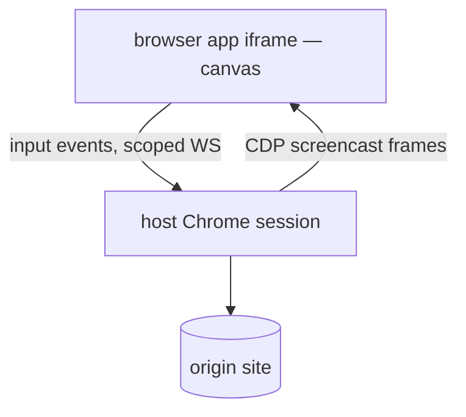
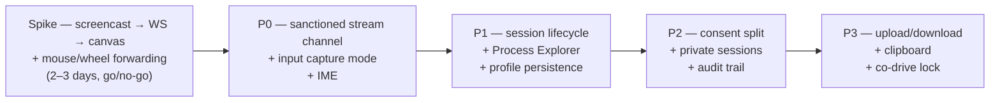

# User-interactable browser: what YAAR itself has to grow

**Status: spike done, and it says go.** Direction is remote render + input forwarding (Path B),
shipped as a live mode of the existing `browser` app. The pre-P0 spike is built and measured —
numbers and what they change are in [Spike results](#spike-results-pre-p0) at the bottom.

## Where we are now

| | `browser` | `browser-user` |
|---|---|---|
| Engine | server-side headless Chrome, host-owned | the user's real Chrome |
| Surface in YAAR | a **still screenshot** + URL bar | a **tab list**, no pixels |
| Who acts | agent only (`click`, `type`, `press`, `scroll` by selector/coords) | agent only, via Bridge extension |
| User's hands | can't touch it — `refresh` is agent-initiated | user acts *in Chrome*, outside YAAR |

So the missing thing isn't a browser. It's **a window whose pixels update on their own and whose
input comes from the human**. Everything below is the host-side (OS) work that neither app can do
from inside its iframe.

More is already in place than it looks: `packages/server/src/lib/browser/session.ts` carries the
full CDP input layer (`Input.dispatchMouseEvent` / `dispatchKeyEvent` / `insertText`, scroll,
drag), plus session pooling and profile management. The agent side of this architecture is done.
What's missing is the screencast out, the human's input in, and the compositor's capture mode.

---

## The decided architecture

Keep Chrome server-side, stream its pixels into the window, forward the human's input into the
same CDP session the agent already drives. Sandbox stays intact, sites see a normal browser, no
URL rewriting. Cost is bandwidth, latency and a streaming channel.

**The proxy alternative is rejected, with no "reader mode" carve-out.** A reverse proxy that
strips `X-Frame-Options` / CSP and rewrites URLs gives a real DOM at near-zero latency, but the
page then runs *as YAAR's origin* — any proxied site can read YAAR's storage and postMessage the
OS. A CSP-stripping proxy is a standing security liability that will get reached for beyond its
intended scope the moment it exists, and the still-screenshot mode already covers "just show me
the page."

**This grows `browser`; it is not a new app.** User and agent must share one CDP session for
co-driving to work at all, so the 18 existing agent commands and the shared-session semantics
fall out for free. The stream channel is the only new protocol surface.

---

## Why this is worth building at all

`browser-user` already lets the human browse — in their own Chrome. The live `browser` mode is
differentiated on three axes, and it's the combination that matters:

1. **Remote mode** — driving a real browser from a phone through YAAR, which `browser-user`
   structurally cannot do;
2. **Isolation** — the session is sandboxed away from the user's real profile;
3. **True co-driving** — agent and human share the *exact same* session: "I got you to the
   payment page, you type the card."

---

## Work items

### 1. A high-bandwidth side channel for apps — *the blocker*
App protocol today is request/response JSON over postMessage, driven by `app_command`. That can't
carry 20–30 fps of frames. YAAR needs a sanctioned stream primitive:

- host mints a WebSocket URL **scoped to `{appId, windowId}`**, token-authenticated,
  auto-revoked when the window closes — alongside the existing WS server, not a new transport
  (no WebTransport; revisit only if measurements demand it);
- binary frames both ways, no agent in the path;
- the app declares it in `app.json` permissions, the user grants it at install.

This is generic infrastructure — a video editor preview, a remote desktop, a live sensor feed all
want it. Don't special-case the browser.

### 2. Per-window raw input capture
Right now the desktop owns the pointer: **left-click-drag is the drawing gesture**, plus window
move/resize, right-click menus and global shortcuts. A browser window needs a mode where the
compositor stops interpreting and just forwards:

- `captureInput: true` on a window, with a visible frame + a guaranteed escape (Esc, or a chrome
  strip outside the capture area);
- pointer coords normalized to the remote viewport with DPR mapping;
- wheel, middle-click, drag, and multi-touch passthrough;
- shortcut suppression while captured (or the browser never gets Ctrl-F).

### 3. Keyboard + IME — day one, not polish
Keydown forwarding is easy; **composition is not**. Korean/Japanese input means
`compositionstart/update/end` has to survive the trip and land as CDP
`Input.imeSetComposition` / `insertText`. If this is skipped, the browser is unusable for CJK
users — which includes this project's primary user. It ships in the first cut or the first cut
doesn't ship.

### 4. Session lifecycle as a first-class process
A headless Chrome is a heavy, long-lived process, not a request handler.

- named sessions that outlive window reloads (`browserId` already hints at this);
- idle GC, memory ceiling, crash-restart with URL replay;
- visible in **Process Explorer** and killable there;
- per-session profile dir persisted under the app's private storage so logins survive.

### 5. Consent model — agent intent vs. user intent
`yaar://config/domains` gates *agent* HTTP. A human typing a URL is a different act and should
not raise an allowlist prompt. So YAAR needs to distinguish the two callers on the same session,
and:

- log agent-initiated navigations/clicks into an audit trail the user can see;
- borrow `browser-user`'s per-origin "Allow use" idea for the *reverse* direction — the user
  marks which origins the **agent** may drive.

### 6. Credential containment (the part people forget)
Once the user logs into their bank in that window,
`read('yaar://windows/x/state/__screenshot')` hands the agent a picture of it, and `extract`
hands it the text. v1 policy is deliberately blunt:

- a **private session** flag: agent gets a redacted placeholder for `__screenshot` /
  `__content`, period — no fine-grained redaction design up front;
- cookie jar never readable through any `yaar://` path;
- a badge in the titlebar showing whether the agent can currently see this window.

### 7. File in / file out
- uploads: a file picker that resolves to `yaar://storage/…` and is injected via
  `DOM.setFileInputFiles` — the remote Chrome has no access to the user's disk;
- downloads: land in `temp/` or `files/`, with a notification carrying the storage URI;
- clipboard: bidirectional bridge to `yaar://user/clipboard`, gated on a user gesture.

### 8. Co-driving
User and agent share one session. Minimum viable: a soft lock — while the agent holds a turn the
window shows "agent is driving", user input is queued or preempts and cancels the agent's turn.
Without this, the agent's `click(selector)` fires into a page the user just navigated away from.

### 9. Remote mode — mostly already solved by the transport
CDP `Page.startScreencast` emits JPEG with a quality knob and **only sends frames when pixels
change** — a mostly-idle page costs near zero. Over Tailscale to a phone, quality ramping on the
existing screencast is expected to be sufficient. WebRTC / VP8 / H.264 is **not** a planned
phase; it happens only if latency measurements on real remote use say so.

---

## Phasing

**The spike comes before any commitment.** A branch that does only `Page.startScreencast` → ad
hoc WS → canvas in the existing `browser` app, plus mouse/wheel forwarding — no capture-mode UI,
no permissions, no policy work. Measure latency and frame rate locally and over Tailscale. If it
feels good in the hand, everything after P0 is low-risk policy and lifecycle work; if it feels
laggy, that's days spent finding out, not weeks.

P0 is then the productionized version of the spike: the properly scoped stream channel, the
compositor capture mode, and IME. Once P0 lands cleanly, the browser app itself is a canvas, a
URL bar and about 400 lines — everything after that is policy work.

---

## Spike results (pre-P0)

### What was built

`Page.startScreencast` → an ad hoc WebSocket → a canvas in the existing `browser` app, plus
mouse/wheel/key forwarding back into the same CDP session the agent drives. Roughly 600 lines,
no capture-mode UI, no permissions work, no IME.

| | |
|---|---|
| `lib/browser/session.ts` | `startScreencast` / `stopScreencast` (refcounted, immediate frame-ack), `dispatchMouse` / `dispatchKey` / `insertText` / `setViewport` |
| `websocket/screencast-handlers.ts` | the socket: frames out as `[uint32 len][JSON header][JPEG]`, input in as JSON, drop-on-backpressure, per-viewer counters |
| `http/server.ts` | upgrade at `GET /api/browser/{id}/screencast`, behind the same `yaar-web` iframe-token gate the screenshot and SSE routes use, with clamped `?quality=` / `?maxWidth=` |
| `apps/browser/src/live.ts` | canvas paint, coordinate mapping, rAF-coalesced pointer forwarding, viewport sync, and the on-screen fps / lag / bitrate readout |

### The numbers

Continuous scroll of a real page (the worst case — every pixel changes) at a 1092×732 viewport,
measured end to end in the app, wired localhost:

| preset | frame | fps | input→pixel | bitrate | dropped |
|---|---|---|---|---|---|
| High (q70, native) | 1092×732 | 23–26 | 32–36 ms | ~17 Mbps | 0 |
| Medium (q45, ≤1024) | 1024×686 | 23–25 | 32–35 ms | ~10.5 Mbps | 0 |
| Low (q30, ≤800) | 800×536 | 20–26 | 31–44 ms | ~5.1 Mbps | 0 |

Idle costs nothing: a page with no damage emits no frames and no bytes, exactly as work item 9
assumed.

**Frame rate is Chrome-bound, not link-bound.** Quality moves bitrate by 3.4× and leaves fps
flat. A raw CDP benchmark with no YAAR in the path — straight to the headless Chrome's debugger
socket — gets 23.3 fps and a p50 inter-frame gap of 18 ms, so YAAR's transport adds nothing
measurable to what Chrome can produce. The interesting corollary is that quality is a pure
bandwidth knob: it buys nothing on a fast link and costs nothing in responsiveness on a slow one.

### It feels right in the hand

Verified with a real mouse and keyboard, not synthesized events: wheel scrolling, click-to-
navigate, typing into a remote form field (the site's own autocomplete reacted), and — the
differentiator the whole proposal rests on — **co-driving**. The human typed a search query into
the live canvas, the agent pressed Enter on the same CDP session, and the result page streamed
back into the canvas. No handoff, no second session, no state to reconcile.

### What the spike changed

- **Bandwidth is the remote risk; latency is not.** 32–36 ms is well inside "direct", and the
  quality ladder works as predicted. What this spike did *not* measure is a sustained session
  over the real Tailscale link to a phone, and 5 Mbps at the low preset is not obviously free
  there. Take that reading before P0 commits — it is the one number still missing, and it is
  the only thing that could still argue for a real codec.
- **A hidden window must pause the stream.** Chrome clamps a background tab's timers to 1 s
  while WebSocket delivery keeps running, so a minimized or occluded browser window would keep
  paying full bitrate for frames nobody paints. P0's capture mode should carry a visibility
  policy; it is a correctness fix and the largest single bandwidth win available.
- **Work item 5 shows up immediately as a UI bug.** The URL bar does not follow a user-initiated
  navigation, because `BrowserSession`'s `updated` event only fires on agent commands. The
  agent-intent / user-intent split is not just a consent question — the window cannot describe
  itself correctly without it.
- **Work item 4 is load-bearing sooner than the phasing implies.** Reloading the desktop kills
  the browser session out from under the window, and live mode then sits on a dead canvas
  showing `No browser session 0`. Named sessions that outlive window reloads are what fixes it.
- The refcounted screencast lets the first viewer's quality settings hold for everyone. Fine for
  one viewer; the sanctioned stream channel needs per-viewer encoding or an explicit "one
  encoder, negotiated settings" rule.
